# UDC File Encryption — Envelope Encryption Architecture

## Table of Contents

- [1. Problem Statement](#1-problem-statement)
- [2. Solution Overview](#2-solution-overview)
- [3. Encryption Architecture](#3-encryption-architecture)
- [4. Key Management](#4-key-management)
- [5. Encrypted File Format](#5-encrypted-file-format)
- [6. Data Flow — Where Encryption Happens](#6-data-flow--where-encryption-happens)
- [7. Integration Points](#7-integration-points)
- [8. Chunked File Encryption](#8-chunked-file-encryption)
- [9. Security Properties](#9-security-properties)
- [10. Performance Benchmarks](#10-performance-benchmarks)
- [11. Key Rotation](#11-key-rotation)
- [12. Prototype Structure](#12-prototype-structure)
- [13. Decryption Architecture](#13-decryption-architecture)
- [14. STS UnwrapFileEnvelope Endpoint](#14-sts-unwrapfileenvelope-endpoint)
- [15. L4 Decryption Pipeline](#15-l4-decryption-pipeline)
- [16. End-to-End Data Flow](#16-end-to-end-data-flow)
- [17. Implementation File Reference](#17-implementation-file-reference)
- [18. Configuration Reference](#18-configuration-reference)
- [19. Security Analysis](#19-security-analysis)
- [20. Failure Modes & Resilience](#20-failure-modes--resilience)
- [21. Gateway-Side File Generation Encryption](#21-gateway-side-file-generation-encryption)

---

## 1. Problem Statement

UDC Management Service (on-prem) transfers file data to the UDC Collection Gateway (cloud) over HTTPS. Currently, some file categories apply **Base64 encoding** before transfer via `EncodeStream()` and `EncodeString()` in `FileTransfer\Common\Utilities.cs`. Base64 is **not encryption** — it's a reversible encoding that provides **zero confidentiality**. Any on-prem user, network sniffer (if TLS is compromised), or intermediate system can reverse it trivially.

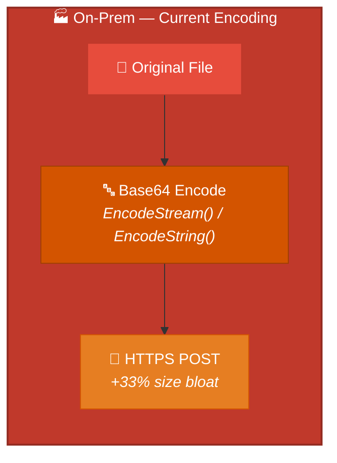
```mermaid
graph LR
    subgraph ON_PREM["🏭 On-Prem — Current Encoding"]
        A["📄 Original File"] --> B["🔤 Base64 Encode<br/><i>EncodeStream() / EncodeString()</i>"]
        B --> C["📡 HTTPS POST<br/><i>+33% size bloat</i>"]
    end

    style ON_PREM fill:#c0392b,stroke:#922b21,stroke-width:2px,color:#fff
    style A fill:#e74c3c,stroke:#c0392b,color:#fff
    style B fill:#d35400,stroke:#a04000,color:#fff
    style C fill:#e67e22,stroke:#d35400,color:#fff
```

With **real encryption**, the on-prem encoding step is replaced:

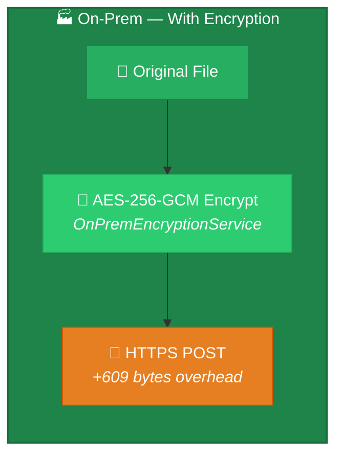
```mermaid
graph LR
    subgraph ON_PREM["🏭 On-Prem — With Encryption"]
        A["📄 Original File"] --> B["🔐 AES-256-GCM Encrypt<br/><i>OnPremEncryptionService</i>"]
        B --> C["📡 HTTPS POST<br/><i>+609 bytes overhead</i>"]
    end

    style ON_PREM fill:#1e8449,stroke:#196f3d,stroke-width:2px,color:#fff
    style A fill:#27ae60,stroke:#1e8449,color:#fff
    style B fill:#2ecc71,stroke:#27ae60,color:#fff
    style C fill:#e67e22,stroke:#d35400,color:#fff
```

### What's wrong with Base64?

| Aspect | Base64 Encoding (Current) | AES-256-GCM Encryption (Proposed) |
|--------|---------------------------|-----------------------------------|
| Confidentiality | ❌ None — anyone can reverse it | ✅ Only key holder can read content |
| Integrity | ❌ None — content can be modified silently | ✅ GCM authentication tag detects any tampering |
| Key required? | ❌ No | ✅ Yes — 256-bit random key per file |
| Size impact | ⬆️ +33% bloat | ⬆️ +609 bytes fixed overhead |
| Performance | ~same | ~same (AES-NI hardware acceleration) |

---

## 2. Solution Overview

We use **Envelope Encryption** — the industry standard pattern used by AWS KMS, Azure Key Vault, and Google Cloud KMS.

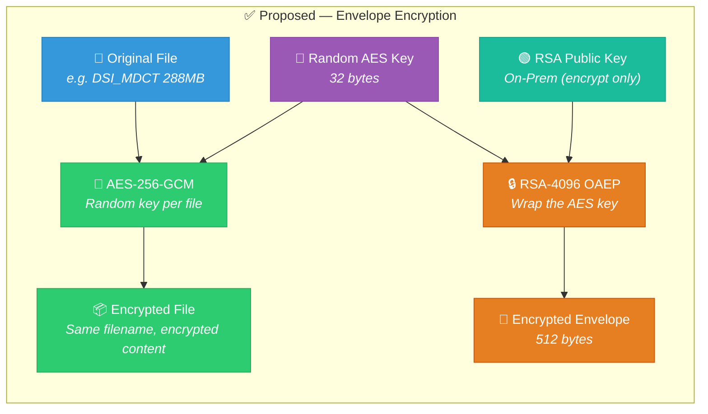
```mermaid
graph TB
    subgraph "✅ Proposed — Envelope Encryption"
        direction TB
        A["📄 Original File<br/><i>e.g. DSI_MDCT 288MB</i>"] --> B["🔐 AES-256-GCM<br/><i>Random key per file</i>"]
        B --> C["📦 Encrypted File<br/><i>Same filename, encrypted content</i>"]
        
        K1["🔑 Random AES Key<br/><i>32 bytes</i>"] --> B
        K1 --> R["🔒 RSA-4096 OAEP<br/><i>Wrap the AES key</i>"]
        R --> ENV["📨 Encrypted Envelope<br/><i>512 bytes</i>"]
        
        PUB["🟢 RSA Public Key<br/><i>On-Prem (encrypt only)</i>"] --> R
    end

    style A fill:#3498db,stroke:#2980b9,color:#fff
    style B fill:#2ecc71,stroke:#27ae60,color:#fff
    style C fill:#2ecc71,stroke:#27ae60,color:#fff
    style K1 fill:#9b59b6,stroke:#8e44ad,color:#fff
    style R fill:#e67e22,stroke:#d35400,color:#fff
    style ENV fill:#e67e22,stroke:#d35400,color:#fff
    style PUB fill:#1abc9c,stroke:#16a085,color:#fff
```

### Why Envelope Encryption?

| Concern | Solution |
|---------|----------|
| **"RSA is slow for large files"** | RSA only encrypts the 44-byte key material. AES handles the bulk data at hardware speed (~250+ MB/s) |
| **"Key distribution is hard"** | Only the public key is distributed. Private key never leaves Azure Key Vault HSM |
| **"What if on-prem is compromised?"** | Attacker gets the public key — they can **only encrypt**, never read existing data. Past files remain safe |
| **"How do we rotate keys?"** | Key version is embedded in the file header. Gateway uses the version to pick the right Key Vault key |

---

## 3. Encryption Architecture — On-Prem Encryption Steps

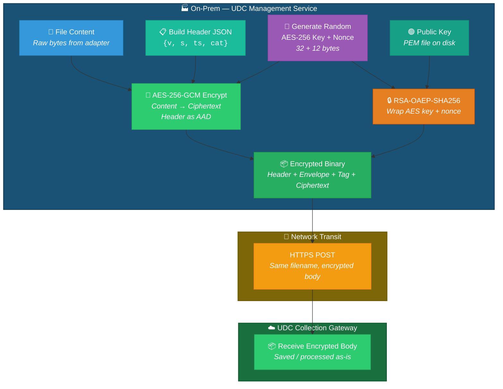
```mermaid
flowchart TB
    subgraph ON_PREM["🏭 On-Prem — UDC Management Service"]
        direction TB
        FILE["📄 File Content<br/><i>Raw bytes from adapter</i>"]
        HEADER["📋 Build Header JSON<br/><code>{v, s, ts, cat}</code>"]
        AESKEY["🎲 Generate Random<br/>AES-256 Key + Nonce<br/><i>32 + 12 bytes</i>"]
        AESGCM["🔐 AES-256-GCM Encrypt<br/><i>Content → Ciphertext</i><br/><i>Header as AAD</i>"]
        RSAWRAP["🔒 RSA-OAEP-SHA256<br/><i>Wrap AES key + nonce</i>"]
        OUTPUT["📦 Encrypted Binary<br/><i>Header + Envelope + Tag + Ciphertext</i>"]
        PUBKEY["🟢 Public Key<br/><i>PEM file on disk</i>"]

        FILE --> AESGCM
        HEADER --> AESGCM
        AESKEY --> AESGCM
        AESKEY --> RSAWRAP
        PUBKEY --> RSAWRAP
        AESGCM --> OUTPUT
        RSAWRAP --> OUTPUT
    end

    subgraph TRANSIT["📡 Network Transit"]
        HTTPS["HTTPS POST<br/><i>Same filename, encrypted body</i>"]
    end

    subgraph GW["☁️ UDC Collection Gateway"]
        RECV["📦 Receive Encrypted Body<br/><i>Saved / processed as-is</i>"]
    end

    OUTPUT --> HTTPS
    HTTPS --> RECV

    style ON_PREM fill:#1a5276,stroke:#154360,stroke-width:2px,color:#fff
    style TRANSIT fill:#7d6608,stroke:#6e5c07,stroke-width:2px,color:#fff
    style GW fill:#196f3d,stroke:#145a32,stroke-width:2px,color:#fff
    style FILE fill:#3498db,stroke:#2980b9,color:#fff
    style HEADER fill:#1abc9c,stroke:#16a085,color:#fff
    style AESKEY fill:#9b59b6,stroke:#8e44ad,color:#fff
    style AESGCM fill:#2ecc71,stroke:#27ae60,color:#fff
    style RSAWRAP fill:#e67e22,stroke:#d35400,color:#fff
    style OUTPUT fill:#27ae60,stroke:#1e8449,color:#fff
    style PUBKEY fill:#16a085,stroke:#138d75,color:#fff
    style HTTPS fill:#f39c12,stroke:#e67e22,color:#fff
    style RECV fill:#2ecc71,stroke:#27ae60,color:#fff
```

### Algorithm Specifications

| Component | Algorithm | Key Size | Details |
|-----------|-----------|----------|---------|
| **Content Encryption** | AES-256-GCM | 256-bit (32 bytes) | AEAD — provides encryption + authentication in one pass |
| **Key Wrapping** | RSA-OAEP-SHA256 | 4096-bit | Asymmetric — on-prem encrypts with public key |
| **Nonce** | Random | 96-bit (12 bytes) | Unique per file, never reused |
| **Auth Tag** | GCM Tag | 128-bit (16 bytes) | Tamper detection — any modification is caught |
| **AAD** | Header JSON | Variable | Authenticated Associated Data — header is tamper-proof |

---

## 4. Key Management

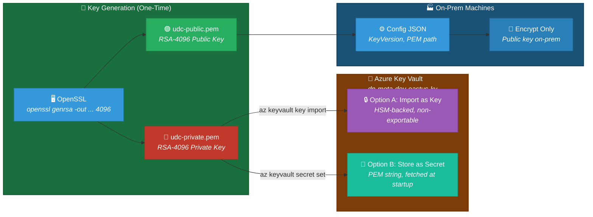
```mermaid
flowchart LR
    subgraph GEN["🔧 Key Generation (One-Time)"]
        OPENSSL["🖥️ OpenSSL<br/><i>openssl genrsa -out ... 4096</i>"]
        PRIV_PEM["🔴 udc-private.pem<br/><i>RSA-4096 Private Key</i>"]
        PUB_PEM["🟢 udc-public.pem<br/><i>RSA-4096 Public Key</i>"]
        OPENSSL --> PRIV_PEM
        OPENSSL --> PUB_PEM
    end

    subgraph AKV["🔐 Azure Key Vault<br/><i>dp-meta-dev-eastus-kv</i>"]
        OPTION_A["🔒 Option A: Import as Key<br/><i>HSM-backed, non-exportable</i>"]
        OPTION_B["📄 Option B: Store as Secret<br/><i>PEM string, fetched at startup</i>"]
    end

    subgraph ONPREM["🏭 On-Prem Machines"]
        CONFIG["⚙️ Config JSON<br/><i>KeyVersion, PEM path</i>"]
        ENCRYPT["🔐 Encrypt Only<br/><i>Public key on-prem</i>"]
        CONFIG --> ENCRYPT
    end

    PRIV_PEM -->|"az keyvault key import"| OPTION_A
    PRIV_PEM -->|"az keyvault secret set"| OPTION_B
    PUB_PEM --> CONFIG

    style GEN fill:#196f3d,stroke:#145a32,stroke-width:2px,color:#fff
    style AKV fill:#7d3c08,stroke:#6e3407,stroke-width:2px,color:#fff
    style ONPREM fill:#1a5276,stroke:#154360,stroke-width:2px,color:#fff
    style OPENSSL fill:#3498db,stroke:#2980b9,color:#fff
    style PRIV_PEM fill:#c0392b,stroke:#a93226,color:#fff
    style PUB_PEM fill:#27ae60,stroke:#1e8449,color:#fff
    style OPTION_A fill:#9b59b6,stroke:#8e44ad,color:#fff
    style OPTION_B fill:#1abc9c,stroke:#16a085,color:#fff
    style CONFIG fill:#3498db,stroke:#2980b9,color:#fff
    style ENCRYPT fill:#2980b9,stroke:#21618c,color:#fff
```

### Key Provisioning Options

There are two ways to provision the RSA key pair. Both use a **self-generated** RSA-4096 key pair — the difference is how the private key is stored in Azure Key Vault.

#### Option A: Import as Key Vault Key (HSM-backed)

The private key is imported into Key Vault as a **Key** object. Cryptographic operations (unwrap) execute inside the HSM — the private key never leaves the HSM after import. Decryption uses `CryptographyClient.UnwrapKeyAsync()`.

```bash
# 1. Generate RSA-4096 key pair locally
openssl genrsa -out udc-private.pem 4096
openssl rsa -in udc-private.pem -pubout -out udc-public.pem

# 2. Import private key into Key Vault as a Key
az keyvault key import \
  --vault-name dp-meta-dev-eastus-kv \
  --name udc-file-encryption-key \
  --pem-file udc-private.pem \
  --protection hsm \
  --ops decrypt unwrapKey

# 3. Delete local private key after import (keep backup offline if needed)
# rm udc-private.pem

# 4. Distribute public key to on-prem
# cp udc-public.pem → on-prem machines
```

#### Option B: Import as Key Vault Secret (Recommended)

The private key PEM is stored as a **Secret** string. The STS fetches the PEM at startup, loads it into an RSA instance, and performs the unwrap in-process. Simpler code, no `CryptographyClient` dependency.

```bash
# 1. Generate RSA-4096 key pair locally
openssl genrsa -out udc-private.pem 4096
openssl rsa -in udc-private.pem -pubout -out udc-public.pem

# 2. Store private key PEM as a Key Vault Secret
az keyvault secret set \
  --vault-name dp-meta-dev-eastus-kv \
  --name udc-file-encryption-private-key \
  --file udc-private.pem \
  --content-type "application/x-pem-file"

# 3. Delete local private key after import
# rm udc-private.pem

# 4. Distribute public key to on-prem
# cp udc-public.pem → on-prem machines
```

#### Option Comparison

| Aspect | Option A: Key Vault Key (HSM) | Option B: Key Vault Secret (PEM) |
|--------|-------------------------------|----------------------------------|
| Private key location at runtime | Inside HSM — never leaves hardware | In STS process memory (fetched from KV at startup) |
| Decryption code | `CryptographyClient.UnwrapKeyAsync()` | `RSA.ImportFromPem()` → `RSA.Decrypt()` |
| Dependencies | `Azure.Security.KeyVault.Keys` + `Azure.Identity` | `Azure.Security.KeyVault.Secrets` + `Azure.Identity` |
| Azure dependency removed? | No — every unwrap calls Key Vault API | **Partial** — only fetches secret at startup, then decrypts locally |
| Latency per file | ~20-50ms (network round-trip to KV per unwrap) | ~0.1ms (local RSA decrypt in memory) |
| FIPS 140-2 compliance | ✅ HSM-certified | ❌ Key in app memory |
| Key exportable? | Configurable (`--exportable false`) | Always retrievable by authorized callers |
| Audit logging | Every crypto operation logged by KV | Every secret read logged by KV |
| Code complexity | Higher (CryptographyClient, caching, error handling) | **Lower** (standard RSA API, no remote calls per file) |
| Offline resilience | ❌ Fails if Key Vault unreachable | ✅ Works after initial secret fetch (can cache PEM) |

> **Recommendation:** Option B (Secret) is simpler, faster, and has fewer runtime dependencies. Use Option A only if FIPS 140-2 HSM compliance is a hard requirement.

### Key Vault Setup (Common for Both Options)

```bash
# Create the Key Vault (if not already existing)
az keyvault create \
  --name dp-meta-dev-eastus-kv \
  --resource-group dp-meta-dev-eastus-rg \
  --location eastus \
  --sku premium    # Required for HSM-backed keys (Option A)
```

### On-Prem Configuration

```json
{
  "UdcEncryption": {
    "SiteId": "SPA2K12",
    "KeyVersion": "UDC_KEY_V_1.0",
    "PublicKeyPemPath": "C:\\ProgramData\\Honeywell\\UDC\\Keys\\udc-file-encryption-key.pem",
    "KeyExpiresAt": "2027-05-12T00:00:00Z"
  }
}
```

> **On-prem encryption is identical for both options** — it only uses the public key PEM file. The option choice only affects the decryption (cloud) side.

### Key Security Properties

| Property | Value | Why |
|----------|-------|-----|
| Key Type | RSA-4096 | Maximum asymmetric key strength |
| Key Generation | Self-managed (OpenSSL) | Full control over key material |
| Private Key Storage | Key Vault (Key or Secret) | Centralized, RBAC-protected, audit-logged |
| Operations | encrypt, wrapKey (on-prem) / decrypt, unwrapKey (cloud) | Minimum required per side |
| On-Prem has | Public key only | Compromise of on-prem ≠ compromise of data |

---

## 5. Encrypted File Format

The encrypted file uses a compact binary layout with only **~609 bytes** of fixed overhead regardless of file size.

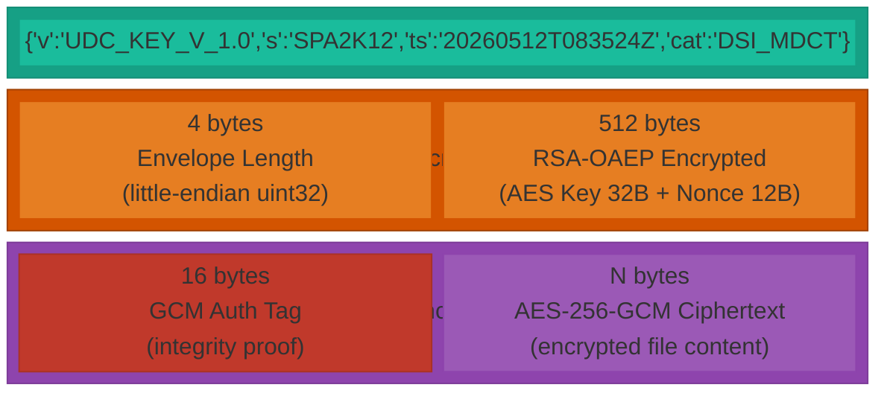
```mermaid
block-beta
    columns 1
    block:header["📋 Section 1: Header (Plaintext JSON + newline)"]
        H1["{'v':'UDC_KEY_V_1.0','s':'SPA2K12','ts':'20260512T083524Z','cat':'DSI_MDCT'}\n"]
    end
    block:envelope["📨 Section 2: Encrypted Envelope"]
        E1["4 bytes<br/>Envelope Length<br/>(little-endian uint32)"]
        E2["512 bytes<br/>RSA-OAEP Encrypted<br/>(AES Key 32B + Nonce 12B)"]
    end
    block:payload["🔐 Section 3: Encrypted Payload"]
        P1["16 bytes<br/>GCM Auth Tag<br/>(integrity proof)"]
        P2["N bytes<br/>AES-256-GCM Ciphertext<br/>(encrypted file content)"]
    end

    style header fill:#16a085,stroke:#138d75,color:#fff
    style envelope fill:#d35400,stroke:#a04000,color:#fff
    style payload fill:#8e44ad,stroke:#7d3c98,color:#fff
    style H1 fill:#1abc9c,stroke:#16a085,color:#fff
    style E1 fill:#e67e22,stroke:#d35400,color:#fff
    style E2 fill:#e67e22,stroke:#d35400,color:#fff
    style P1 fill:#c0392b,stroke:#a93226,color:#fff
    style P2 fill:#9b59b6,stroke:#8e44ad,color:#fff
```

### Byte Layout

| Offset | Size | Content | Encrypted? |
|--------|------|---------|------------|
| `0` | ~77-101 bytes | Header JSON + `\n` | ❌ Plaintext (but authenticated via AAD) |
| `H+1` | 4 bytes | Envelope length (uint32 LE) | ❌ |
| `H+5` | 512 bytes | RSA-OAEP encrypted (AES key + nonce) | ✅ RSA-4096 |
| `H+517` | 16 bytes | GCM authentication tag | ✅ |
| `H+533` | Remaining | AES-256-GCM ciphertext | ✅ AES-256 |

### Header Fields

```json
{
  "v": "UDC_KEY_V_1.0",     // Key version — for rotation support
  "s": "SPA2K12",            // Site ID — for upload validation
  "ts": "20260512T083524Z",  // Timestamp — audit trail
  "cat": "DSI_MDCT"          // File category — metadata
}
```

> **Why is the header plaintext?** The header must be readable without needing the private key — the receiver uses `v` (key version) to select the correct key and `s` (site ID) to validate the upload. The header is **authenticated** via GCM AAD — any tampering will cause the GCM authentication to fail.

---

## 6. Data Flow — Where Encryption Happens

### Current Flow (No Encryption)

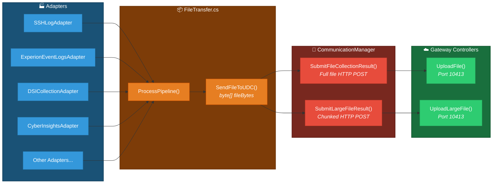
```mermaid
flowchart LR
    subgraph ADAPTERS["🏭 Adapters"]
        A1["SSHLogAdapter"]
        A2["ExperionEventLogsAdapter"]
        A3["DSICollectionAdapter"]
        A4["CyberInsightsAdapter"]
        A5["Other Adapters..."]
    end

    subgraph FT["📦 FileTransfer.cs"]
        PP["ProcessPipeline()"]
        SEND["SendFileToUDC()<br/><i>byte[] fileBytes</i>"]
        PP --> SEND
    end

    subgraph COMM["📡 CommunicationManager"]
        FULL["SubmitFileCollectionResult()<br/><i>Full file HTTP POST</i>"]
        CHUNK["SubmitLargeFileResult()<br/><i>Chunked HTTP POST</i>"]
    end

    subgraph GW["☁️ Gateway Controllers"]
        UPLOAD["UploadFile()<br/><i>Port 10413</i>"]
        LARGE["UploadLargeFile()<br/><i>Port 10413</i>"]
    end

    A1 & A2 & A3 & A4 & A5 --> PP
    SEND --> FULL
    SEND --> CHUNK
    FULL --> UPLOAD
    CHUNK --> LARGE

    style ADAPTERS fill:#1a5276,stroke:#154360,stroke-width:2px,color:#fff
    style FT fill:#7d3c08,stroke:#6e3407,stroke-width:2px,color:#fff
    style COMM fill:#78281f,stroke:#641e16,stroke-width:2px,color:#fff
    style GW fill:#196f3d,stroke:#145a32,stroke-width:2px,color:#fff
    style A1 fill:#3498db,stroke:#2980b9,color:#fff
    style A2 fill:#3498db,stroke:#2980b9,color:#fff
    style A3 fill:#3498db,stroke:#2980b9,color:#fff
    style A4 fill:#3498db,stroke:#2980b9,color:#fff
    style A5 fill:#3498db,stroke:#2980b9,color:#fff
    style PP fill:#e67e22,stroke:#d35400,color:#fff
    style SEND fill:#e67e22,stroke:#d35400,color:#fff
    style FULL fill:#e74c3c,stroke:#c0392b,color:#fff
    style CHUNK fill:#e74c3c,stroke:#c0392b,color:#fff
    style UPLOAD fill:#2ecc71,stroke:#27ae60,color:#fff
    style LARGE fill:#2ecc71,stroke:#27ae60,color:#fff
```

### Proposed Flow (Base64 Encoding Replaced with Real Encryption)

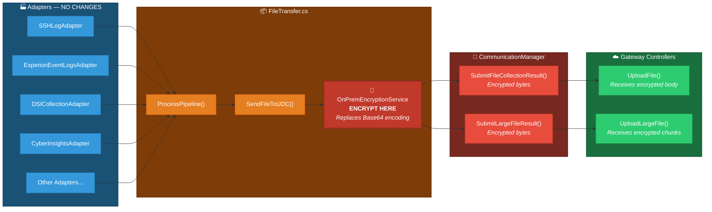
```mermaid
flowchart LR
    subgraph ADAPTERS["🏭 Adapters — NO CHANGES"]
        A1["SSHLogAdapter"]
        A2["ExperionEventLogsAdapter"]
        A3["DSICollectionAdapter"]
        A4["CyberInsightsAdapter"]
        A5["Other Adapters..."]
    end

    subgraph FT["📦 FileTransfer.cs"]
        PP["ProcessPipeline()"]
        SEND["SendFileToUDC()"]
        ENC["🔐 OnPremEncryptionService<br/><b>ENCRYPT HERE</b><br/><i>Replaces Base64 encoding</i>"]
        PP --> SEND
        SEND --> ENC
    end

    subgraph COMM["📡 CommunicationManager"]
        FULL["SubmitFileCollectionResult()<br/><i>Encrypted bytes</i>"]
        CHUNK["SubmitLargeFileResult()<br/><i>Encrypted bytes</i>"]
    end

    subgraph GW["☁️ Gateway Controllers"]
        UPLOAD["UploadFile()<br/><i>Receives encrypted body</i>"]
        LARGE["UploadLargeFile()<br/><i>Receives encrypted chunks</i>"]
    end

    A1 & A2 & A3 & A4 & A5 --> PP
    ENC --> FULL
    ENC --> CHUNK
    FULL --> UPLOAD
    CHUNK --> LARGE

    style ADAPTERS fill:#1a5276,stroke:#154360,stroke-width:2px,color:#fff
    style FT fill:#7d3c08,stroke:#6e3407,stroke-width:2px,color:#fff
    style COMM fill:#78281f,stroke:#641e16,stroke-width:2px,color:#fff
    style GW fill:#196f3d,stroke:#145a32,stroke-width:2px,color:#fff
    style A1 fill:#3498db,stroke:#2980b9,color:#fff
    style A2 fill:#3498db,stroke:#2980b9,color:#fff
    style A3 fill:#3498db,stroke:#2980b9,color:#fff
    style A4 fill:#3498db,stroke:#2980b9,color:#fff
    style A5 fill:#3498db,stroke:#2980b9,color:#fff
    style PP fill:#e67e22,stroke:#d35400,color:#fff
    style SEND fill:#e67e22,stroke:#d35400,color:#fff
    style ENC fill:#c0392b,stroke:#922b21,color:#fff,stroke-width:3px
    style FULL fill:#e74c3c,stroke:#c0392b,color:#fff
    style CHUNK fill:#e74c3c,stroke:#c0392b,color:#fff
    style UPLOAD fill:#2ecc71,stroke:#27ae60,color:#fff
    style LARGE fill:#2ecc71,stroke:#27ae60,color:#fff
```

### Why `SendFileToUDC()` is the Perfect Hook Point

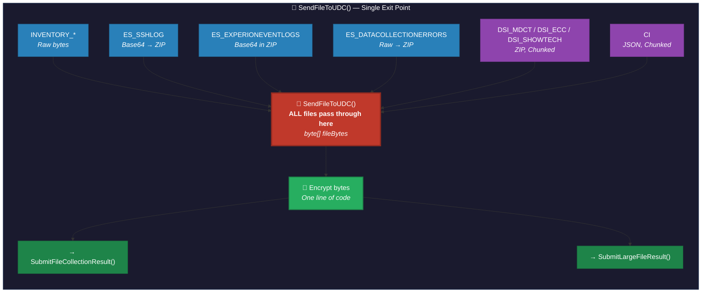
```mermaid
flowchart TB
    subgraph WHY["🎯 SendFileToUDC() — Single Exit Point"]
        direction TB
        
        INV["INVENTORY_*<br/><i>Raw bytes</i>"]
        SSH["ES_SSHLOG<br/><i>Base64 → ZIP</i>"]
        EXP["ES_EXPERIONEVENTLOGS<br/><i>Base64 in ZIP</i>"]
        DCE["ES_DATACOLLECTIONERRORS<br/><i>Raw → ZIP</i>"]
        DSI["DSI_MDCT / DSI_ECC / DSI_SHOWTECH<br/><i>ZIP, Chunked</i>"]
        CI["CI<br/><i>JSON, Chunked</i>"]
        
        FUNNEL["📌 SendFileToUDC()<br/><b>ALL files pass through here</b><br/><i>byte[] fileBytes</i>"]
        
        ENCRYPT["🔐 Encrypt bytes<br/><i>One line of code</i>"]
        
        OUT1["→ SubmitFileCollectionResult()"]
        OUT2["→ SubmitLargeFileResult()"]

        INV & SSH & EXP & DCE & DSI & CI --> FUNNEL
        FUNNEL --> ENCRYPT
        ENCRYPT --> OUT1
        ENCRYPT --> OUT2
    end

    style WHY fill:#1a1a2e,stroke:#16213e,stroke-width:2px,color:#fff
    style FUNNEL fill:#c0392b,stroke:#922b21,color:#fff,stroke-width:3px
    style ENCRYPT fill:#27ae60,stroke:#1e8449,color:#fff,stroke-width:2px
    style INV fill:#2980b9,stroke:#21618c,color:#fff
    style SSH fill:#2980b9,stroke:#21618c,color:#fff
    style EXP fill:#2980b9,stroke:#21618c,color:#fff
    style DCE fill:#2980b9,stroke:#21618c,color:#fff
    style DSI fill:#8e44ad,stroke:#7d3c98,color:#fff
    style CI fill:#8e44ad,stroke:#7d3c98,color:#fff
    style OUT1 fill:#1e8449,stroke:#196f3d,color:#fff
    style OUT2 fill:#1e8449,stroke:#196f3d,color:#fff
```

---

## 7. Integration Points

### On-Prem Side — `FileTransfer.cs` Change

The change is minimal — add encryption before the HTTP dispatch:

```csharp
// FileTransfer.cs — SendFileToUDC()
public static async Task<bool> SendFileToUDC(
    string fileName, byte[] fileBytes, string endPoint, 
    string category, int index, int maxFileCount, string assetName)
{
    // Existing: throttle validation
    await ValidateTimerAndVolumeOfFile(fileBytes.Length, category, index, maxFileCount);

    // ✅ NEW: Encrypt before sending (ONE LINE)
    fileBytes = _encryptionService.EncryptBytes(fileBytes, category);

    // Existing: dispatch to appropriate HTTP method
    if (category == "DSI_MDCT" || category == "DSI_ECC" || 
        category == "DSI_SHOWTECH" || category == "CI")
    {
        return await objCommunicationManager.SubmitLargeFileResult(fileName, fileBytes, endPoint);
    }
    else
    {
        return await objCommunicationManager.SubmitFileCollectionResult(fileName, category, fileBytes, assetName);
    }
}
```

---

## 8. Chunked File Encryption

For large files (DSI_MDCT, DSI_ECC, DSI_SHOWTECH, CI), each chunk is encrypted **independently**.

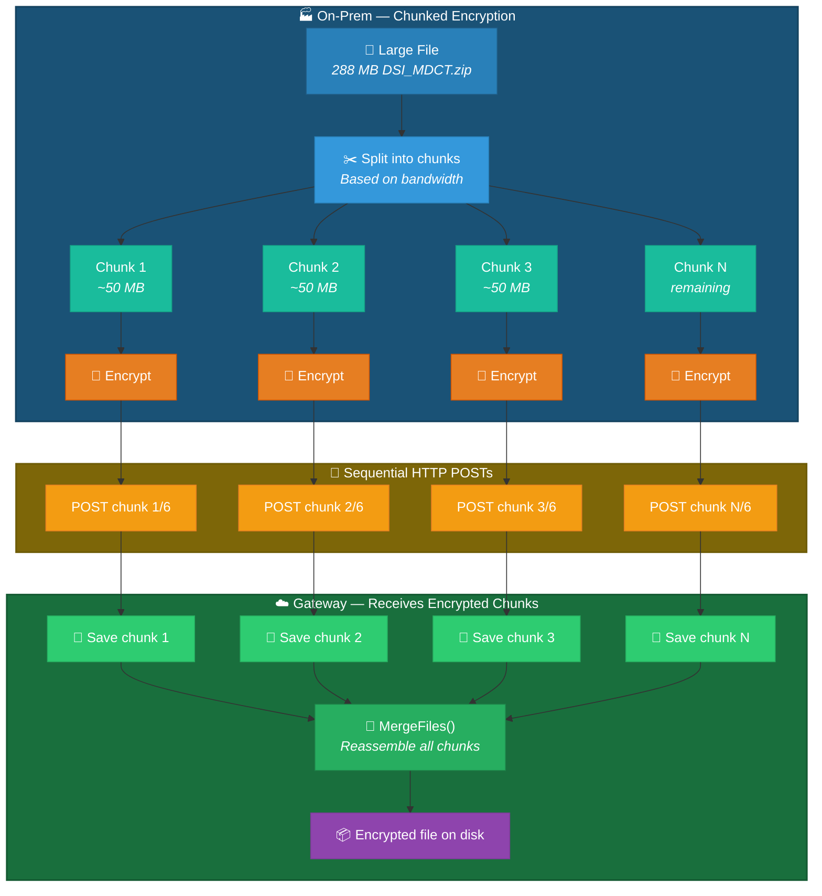
```mermaid
flowchart TB
    subgraph ON_PREM["🏭 On-Prem — Chunked Encryption"]
        direction TB
        BIG["📄 Large File<br/><i>288 MB DSI_MDCT.zip</i>"]
        SPLIT["✂️ Split into chunks<br/><i>Based on bandwidth</i>"]
        
        C1["Chunk 1<br/><i>~50 MB</i>"]
        C2["Chunk 2<br/><i>~50 MB</i>"]
        C3["Chunk 3<br/><i>~50 MB</i>"]
        CN["Chunk N<br/><i>remaining</i>"]
        
        E1["🔐 Encrypt"]
        E2["🔐 Encrypt"]
        E3["🔐 Encrypt"]
        EN["🔐 Encrypt"]
        
        BIG --> SPLIT
        SPLIT --> C1 & C2 & C3 & CN
        C1 --> E1
        C2 --> E2
        C3 --> E3
        CN --> EN
    end
    
    subgraph TRANSIT["📡 Sequential HTTP POSTs"]
        H1["POST chunk 1/6"]
        H2["POST chunk 2/6"]
        H3["POST chunk 3/6"]
        HN["POST chunk N/6"]
    end
    
    subgraph CLOUD["☁️ Gateway — Receives Encrypted Chunks"]
        direction TB
        R1["💾 Save chunk 1"]
        R2["💾 Save chunk 2"]
        R3["💾 Save chunk 3"]
        RN["💾 Save chunk N"]
        MERGE["🔗 MergeFiles()<br/><i>Reassemble all chunks</i>"]
        STORED["📦 Encrypted file on disk"]
        
        R1 & R2 & R3 & RN --> MERGE
        MERGE --> STORED
    end
    
    E1 --> H1 --> R1
    E2 --> H2 --> R2
    E3 --> H3 --> R3
    EN --> HN --> RN

    style ON_PREM fill:#1a5276,stroke:#154360,stroke-width:2px,color:#fff
    style TRANSIT fill:#7d6608,stroke:#6e5c07,stroke-width:2px,color:#fff
    style CLOUD fill:#196f3d,stroke:#145a32,stroke-width:2px,color:#fff
    style BIG fill:#2980b9,stroke:#21618c,color:#fff
    style SPLIT fill:#3498db,stroke:#2980b9,color:#fff
    style C1 fill:#1abc9c,stroke:#16a085,color:#fff
    style C2 fill:#1abc9c,stroke:#16a085,color:#fff
    style C3 fill:#1abc9c,stroke:#16a085,color:#fff
    style CN fill:#1abc9c,stroke:#16a085,color:#fff
    style MERGE fill:#27ae60,stroke:#1e8449,color:#fff
    style STORED fill:#8e44ad,stroke:#7d3c98,color:#fff
    style E1 fill:#e67e22,stroke:#d35400,color:#fff
    style E2 fill:#e67e22,stroke:#d35400,color:#fff
    style E3 fill:#e67e22,stroke:#d35400,color:#fff
    style EN fill:#e67e22,stroke:#d35400,color:#fff
    style H1 fill:#f39c12,stroke:#e67e22,color:#fff
    style H2 fill:#f39c12,stroke:#e67e22,color:#fff
    style H3 fill:#f39c12,stroke:#e67e22,color:#fff
    style HN fill:#f39c12,stroke:#e67e22,color:#fff
    style R1 fill:#2ecc71,stroke:#27ae60,color:#fff
    style R2 fill:#2ecc71,stroke:#27ae60,color:#fff
    style R3 fill:#2ecc71,stroke:#27ae60,color:#fff
    style RN fill:#2ecc71,stroke:#27ae60,color:#fff
```

> **Important:** Each chunk is encrypted independently at `SendFileToUDC()` before the HTTP POST. The Gateway saves the encrypted chunks and merges them as before — the chunking architecture is unchanged. The file content on disk at the Gateway is encrypted.

---

## 9. Security Properties

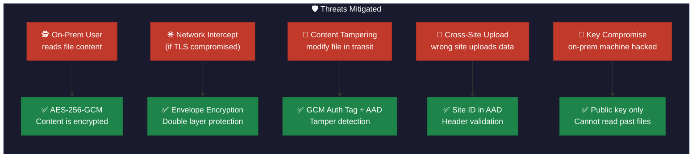
```mermaid
flowchart TB
    subgraph THREATS["🛡️ Threats Mitigated"]
        direction TB
        
        T1["🕵️ On-Prem User<br/>reads file content"]
        T2["🌐 Network Intercept<br/>(if TLS compromised)"]
        T3["📝 Content Tampering<br/>modify file in transit"]
        T4["🔄 Cross-Site Upload<br/>wrong site uploads data"]
        T5["🔑 Key Compromise<br/>on-prem machine hacked"]
        
        M1["✅ AES-256-GCM<br/>Content is encrypted"]
        M2["✅ Envelope Encryption<br/>Double layer protection"]
        M3["✅ GCM Auth Tag + AAD<br/>Tamper detection"]
        M4["✅ Site ID in AAD<br/>Header validation"]
        M5["✅ Public key only<br/>Cannot read past files"]
        
        T1 --> M1
        T2 --> M2
        T3 --> M3
        T4 --> M4
        T5 --> M5
    end

    style THREATS fill:#1a1a2e,stroke:#16213e,stroke-width:2px,color:#fff
    style T1 fill:#c0392b,stroke:#a93226,color:#fff
    style T2 fill:#c0392b,stroke:#a93226,color:#fff
    style T3 fill:#c0392b,stroke:#a93226,color:#fff
    style T4 fill:#c0392b,stroke:#a93226,color:#fff
    style T5 fill:#c0392b,stroke:#a93226,color:#fff
    style M1 fill:#1e8449,stroke:#196f3d,color:#fff
    style M2 fill:#1e8449,stroke:#196f3d,color:#fff
    style M3 fill:#1e8449,stroke:#196f3d,color:#fff
    style M4 fill:#1e8449,stroke:#196f3d,color:#fff
    style M5 fill:#1e8449,stroke:#196f3d,color:#fff
```

### Security Guarantees

| Property | How | Verified In Prototype? |
|----------|-----|----------------------|
| **Confidentiality** | AES-256-GCM encryption — content is unreadable without key | ✅ Demo 1 |
| **Integrity** | GCM authentication tag — any bit flip is detected | ✅ Demo 3 (tamper detection) |
| **Authentication** | Header as AAD — siteId/version/timestamp cannot be forged | ✅ Demo 3 |
| **Site Isolation** | Site ID embedded in header and authenticated via AAD | ✅ Demo 2 (wrong-site rejection) |
| **Forward Secrecy** | Unique random AES key per file — compromising one key doesn't affect other files | ✅ By design |
| **Key Protection** | Private key in HSM, non-exportable | ✅ Key Vault config |

### What happens if...

| Scenario | Result |
|----------|--------|
| Attacker gets the public key PEM file | Can only encrypt, never read existing data. Public key is useless for reading |
| Attacker modifies the encrypted file in transit | `AuthenticationTagMismatchException` — GCM authentication tag catches any modification |
| Attacker changes the header (e.g. site ID) | AAD mismatch → GCM authentication fails |
| Attacker intercepts a chunk during transfer | Individual chunk is encrypted — unreadable without the private key |
| On-prem machine is fully compromised | Past encrypted files remain safe — no private key exists on-prem |

---

## 10. Performance Benchmarks

Tested on a real **288 MB DSI_MDCT zip file** from production.

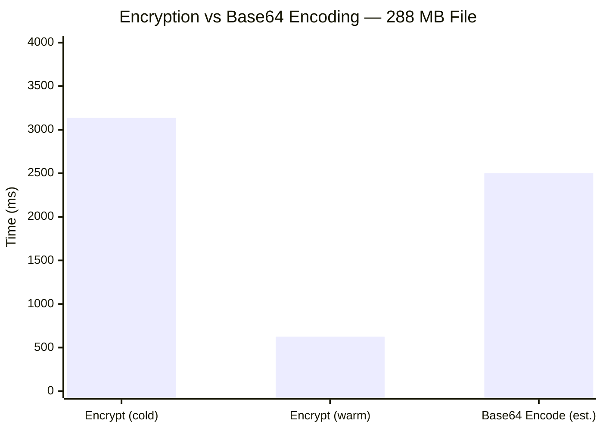
```mermaid
xychart-beta
    title "Encryption vs Base64 Encoding — 288 MB File"
    x-axis ["Encrypt (cold)", "Encrypt (warm)", "Base64 Encode (est.)"]
    y-axis "Time (ms)" 0 --> 4000
    bar [3136, 626, 2500]
```

| Metric | Cold (first run) | Warm (cached) | Notes |
|--------|-------------------|---------------|-------|
| **Encryption** | 3,136 ms (3.1s) | 626 ms (0.6s) | Includes disk I/O |
| **Throughput** | 92 MB/s | 460 MB/s | AES-NI hardware accelerated |
| **Overhead** | 609 bytes | 609 bytes | Fixed, regardless of file size |

### Size Comparison

| File | Original | After Base64 | After Encryption | Savings |
|------|----------|-------------|------------------|---------|
| 288 MB zip | 302,201,064 B | ~403 MB (+33%) | 302,201,673 B (+609 B) | **100 MB less than Base64** |
| 6.8 KB log | 6,884 B | ~9.2 KB (+33%) | 7,506 B (+609 B) | Negligible |

> **Key takeaway:** Encryption adds less overhead than the existing Base64 encoding, while providing actual security.

---

## 11. Key Rotation

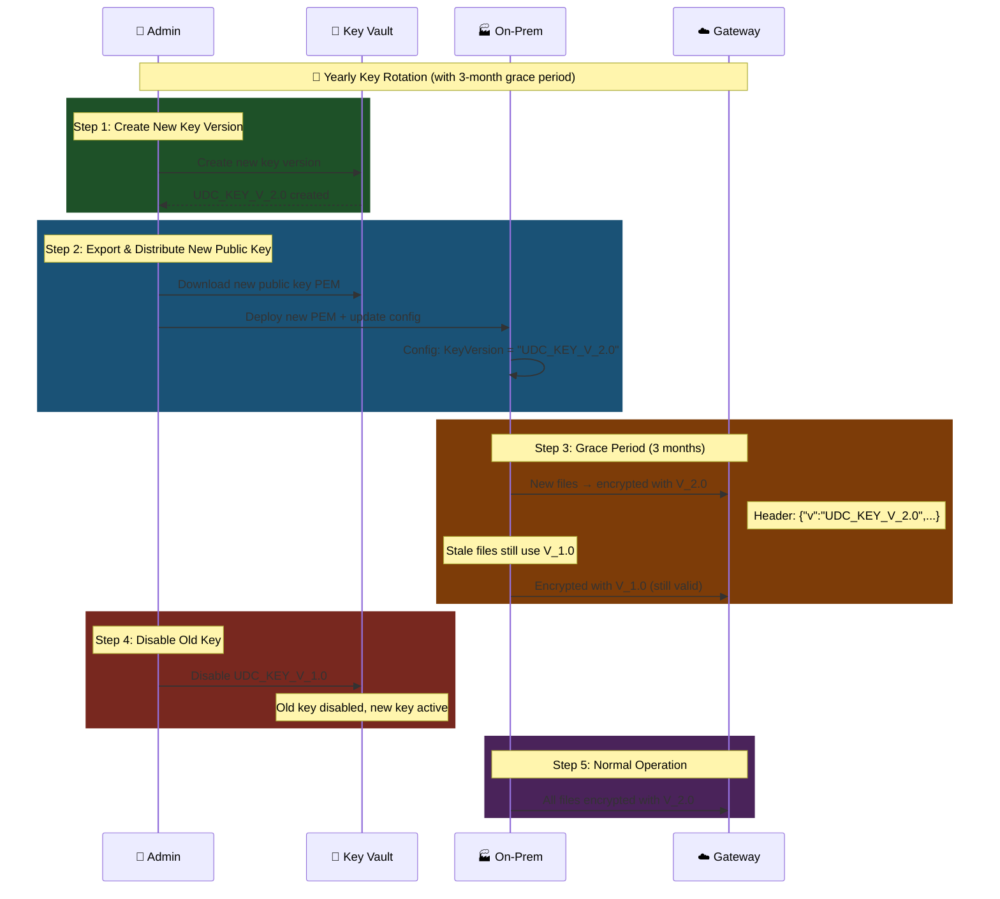
```mermaid
sequenceDiagram
    participant Admin as 👤 Admin
    participant KV as 🔐 Key Vault
    participant OnPrem as 🏭 On-Prem
    participant Gateway as ☁️ Gateway

    Note over Admin,Gateway: 🔄 Yearly Key Rotation (with 3-month grace period)

    rect rgb(30, 81, 40)
        Note over Admin: Step 1: Create New Key Version
        Admin->>KV: Create new key version
        KV-->>Admin: UDC_KEY_V_2.0 created
    end

    rect rgb(26, 82, 118)
        Note over Admin: Step 2: Export & Distribute New Public Key
        Admin->>KV: Download new public key PEM
        Admin->>OnPrem: Deploy new PEM + update config
        OnPrem->>OnPrem: Config: KeyVersion = "UDC_KEY_V_2.0"
    end

    rect rgb(125, 60, 8)
        Note over OnPrem,Gateway: Step 3: Grace Period (3 months)
        OnPrem->>Gateway: New files → encrypted with V_2.0
        Note right of Gateway: Header: {"v":"UDC_KEY_V_2.0",...}
        
        Note over OnPrem: Stale files still use V_1.0
        OnPrem->>Gateway: Encrypted with V_1.0 (still valid)
    end

    rect rgb(120, 40, 31)
        Note over Admin: Step 4: Disable Old Key
        Admin->>KV: Disable UDC_KEY_V_1.0
        Note over KV: Old key disabled, new key active
    end

    rect rgb(74, 35, 90)
        Note over OnPrem,Gateway: Step 5: Normal Operation
        OnPrem->>Gateway: All files encrypted with V_2.0
    end
```

### Version Strategy

| Version | Format | Example | Rotation |
|---------|--------|---------|----------|
| Key Version | `UDC_KEY_V_{major}.{minor}` | `UDC_KEY_V_1.0` | Yearly |
| Grace Period | 3 months | Old + New keys both active | Overlap window |
| Key in Header | `"v": "UDC_KEY_V_1.0"` | Gateway reads this to pick key | Automatic routing |

---

## 12. Prototype Structure

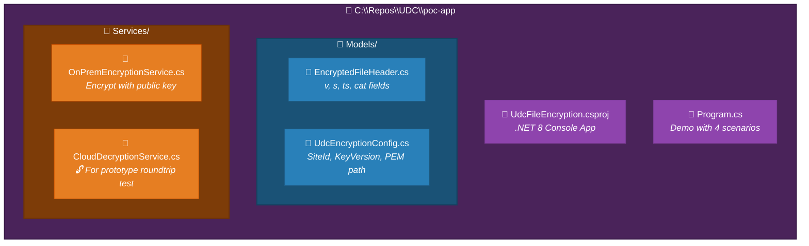
```mermaid
flowchart TB
    subgraph PROTO["📁 C:\\Repos\\UDC\\poc-app"]
        direction TB
        
        PROJ["📄 UdcFileEncryption.csproj<br/><i>.NET 8 Console App</i>"]
        PROG["📄 Program.cs<br/><i>Demo with 4 scenarios</i>"]
        
        subgraph MODELS["📁 Models/"]
            M1["📄 EncryptedFileHeader.cs<br/><i>v, s, ts, cat fields</i>"]
            M2["📄 UdcEncryptionConfig.cs<br/><i>SiteId, KeyVersion, PEM path</i>"]
        end
        
        subgraph SERVICES["📁 Services/"]
            S1["📄 OnPremEncryptionService.cs<br/><i>🔐 Encrypt with public key</i>"]
            S2["📄 CloudDecryptionService.cs<br/><i>🔓 For prototype roundtrip test</i>"]
        end
    end

    style PROTO fill:#4a235a,stroke:#3b1c4a,stroke-width:2px,color:#fff
    style MODELS fill:#1a5276,stroke:#154360,stroke-width:2px,color:#fff
    style SERVICES fill:#7d3c08,stroke:#6e3407,stroke-width:2px,color:#fff
    style PROJ fill:#8e44ad,stroke:#7d3c98,color:#fff
    style PROG fill:#8e44ad,stroke:#7d3c98,color:#fff
    style M1 fill:#2980b9,stroke:#21618c,color:#fff
    style M2 fill:#2980b9,stroke:#21618c,color:#fff
    style S1 fill:#e67e22,stroke:#d35400,color:#fff
    style S2 fill:#e67e22,stroke:#d35400,color:#fff
```

### Running the Prototype

```bash
# Full demo suite (generates test files, encrypts, verifies)
dotnet run

# Single file test (specify any file path)
dotnet run -- "C:\path\to\your\file.zip"

# Single file test with custom output directory (same filename)
dotnet run -- "C:\path\to\your\file.zip" "C:\output\directory"
```

### Demo Scenarios

| Demo | What it proves |
|------|---------------|
| **Demo 1** | Encrypt file and verify content integrity (small + medium files) |
| **Demo 2** | Wrong-site upload prevention (rejected by site ID mismatch) |
| **Demo 3** | Tamper detection (modified header caught by GCM authentication) |
| **Demo 4** | Encrypt with real Key Vault public key (one-way — only Key Vault can read it) |

---

## Summary

| Aspect | Decision |
|--------|----------|
| **Algorithm** | AES-256-GCM (content) + RSA-4096-OAEP-SHA256 (key wrapping) |
| **Encrypt at** | `FileTransfer.SendFileToUDC()` — single choke point, zero adapter changes |
| **Key storage** | Azure Key Vault HSM, non-exportable private key |
| **On-prem has** | Public key only (PEM file) |
| **File format** | Binary: Header + Envelope + AuthTag + Ciphertext |
| **Overhead** | 609 bytes per file (vs. +33% for Base64) |
| **Performance** | ~1 second for 288 MB (AES-NI accelerated) |
| **Filename** | Never changes — only content is encrypted |
| **Chunked files** | Each chunk encrypted independently at `SendFileToUDC()` |
| **Key rotation** | Yearly, 3-month grace period, version in header |
| **Adapters affected** | Zero — encryption is below the adapter layer |

---

## 13. Decryption Architecture

### Design Constraint

L4 UploadClient runs at the **customer site** with internet access. It **cannot access Azure Key Vault or any Azure resource directly** — everything goes through API calls to the **SecurityTokenService (STS)** running in Azure AKS. The private RSA key **never leaves the Key Vault HSM**.

### Why Decrypt at L4 Before Blob Upload?

After L4 uploads a file to Azure Blob, it sends a **Service Bus event** that triggers downstream processing. If decryption happened asynchronously (e.g., Blob Trigger Function), there would be a **race condition** — downstream services would start reading the blob before decryption completes.

```
❌ Race Condition with Async Decryption:
──────────────────────────────────────────────────
L4 uploads encrypted blob     ──→ Done
L4 sends Service Bus event    ──→ Downstream reads blob ⚡ ENCRYPTED!
Blob Trigger fires (1-10s+)   ──→ Function starts decrypting... too late
```

```
✅ No Race with L4 Decrypt-Before-Upload:
──────────────────────────────────────────────────
L4 decrypts locally           ──→ Done
L4 uploads PLAINTEXT blob     ──→ Done
L4 sends Service Bus event    ──→ Downstream reads plaintext ✅
```

### Solution: STS Envelope Unwrap Proxy

L4 sends **only the 512-byte RSA envelope** to STS. STS calls Key Vault `UnwrapKey` (private key stays in HSM). L4 receives the ephemeral AES key, decrypts locally, uploads plaintext to Blob.

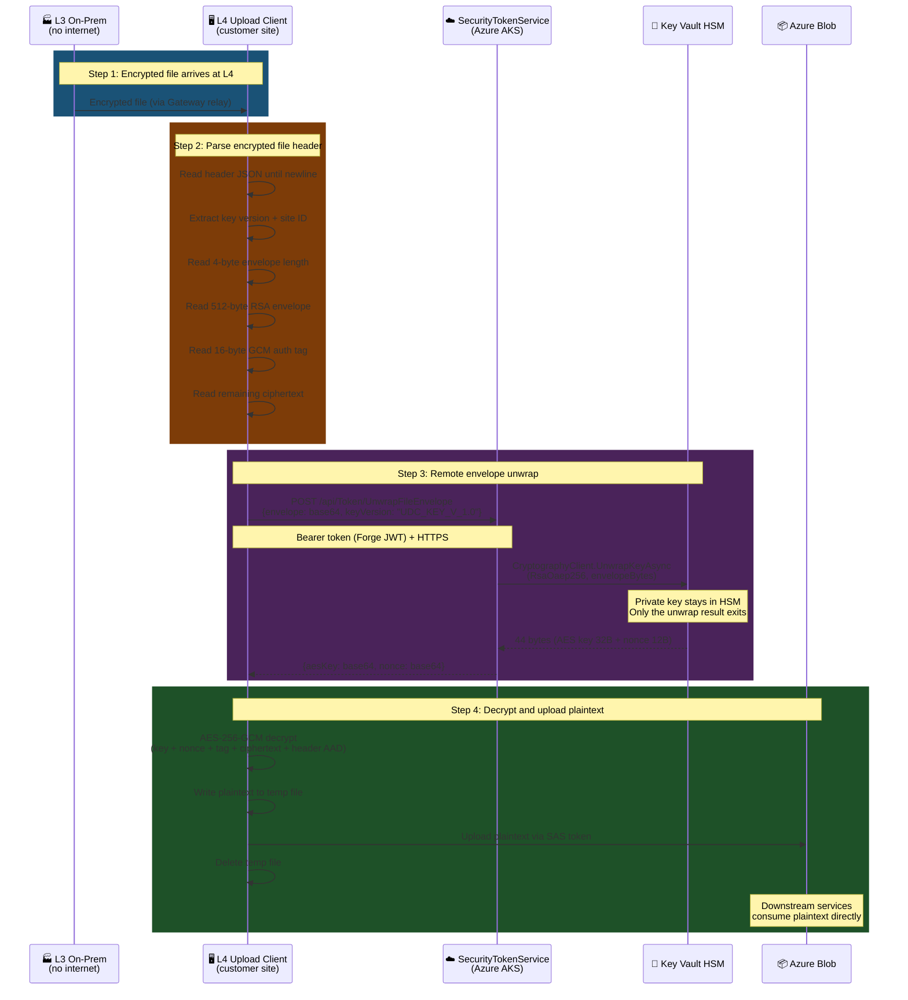
```mermaid
sequenceDiagram
    participant L3 as 🏭 L3 On-Prem<br/>(no internet)
    participant L4 as 🖥️ L4 Upload Client<br/>(customer site)
    participant STS as ☁️ SecurityTokenService<br/>(Azure AKS)
    participant KV as 🔐 Key Vault HSM
    participant Blob as 📦 Azure Blob

    rect rgb(26, 82, 118)
        Note over L3,L4: Step 1: Encrypted file arrives at L4
        L3->>L4: Encrypted file (via Gateway relay)
    end

    rect rgb(125, 60, 8)
        Note over L4: Step 2: Parse encrypted file header
        L4->>L4: Read header JSON until newline
        L4->>L4: Extract key version + site ID
        L4->>L4: Read 4-byte envelope length
        L4->>L4: Read 512-byte RSA envelope
        L4->>L4: Read 16-byte GCM auth tag
        L4->>L4: Read remaining ciphertext
    end

    rect rgb(74, 35, 90)
        Note over L4,KV: Step 3: Remote envelope unwrap
        L4->>STS: POST /api/Token/UnwrapFileEnvelope<br/>{envelope: base64, keyVersion: "UDC_KEY_V_1.0"}
        Note over L4,STS: Bearer token (Forge JWT) + HTTPS
        STS->>KV: CryptographyClient.UnwrapKeyAsync<br/>(RsaOaep256, envelopeBytes)
        Note over KV: Private key stays in HSM<br/>Only the unwrap result exits
        KV-->>STS: 44 bytes (AES key 32B + nonce 12B)
        STS-->>L4: {aesKey: base64, nonce: base64}
    end

    rect rgb(30, 81, 40)
        Note over L4,Blob: Step 4: Decrypt and upload plaintext
        L4->>L4: AES-256-GCM decrypt<br/>(key + nonce + tag + ciphertext + header AAD)
        L4->>L4: Write plaintext to temp file
        L4->>Blob: Upload plaintext via SAS token
        L4->>L4: Delete temp file
        Note over Blob: Downstream services<br/>consume plaintext directly
    end
```

### What Travels Over the Wire

| Direction | Data | Size | Protection |
|-----------|------|------|------------|
| L4 → STS | RSA envelope (base64) + key version | ~700 bytes JSON | HTTPS + Forge Bearer token |
| STS → KV | Raw envelope bytes | 512 bytes | Managed identity + Azure internal |
| KV → STS | Unwrapped key material | 44 bytes | Azure internal |
| STS → L4 | AES key + nonce (base64) | ~80 bytes JSON | HTTPS + Forge Bearer token |
| L4 → Blob | Plaintext file | Original file size | SAS token + HTTPS |

---

## 14. STS UnwrapFileEnvelope Endpoint

### Architecture

The STS endpoint supports **two backend modes** depending on the key provisioning option chosen (see [Section 4](#4-key-management)):

- **Option A (Key Vault Key):** STS calls `CryptographyClient.UnwrapKeyAsync()` — the HSM performs the RSA decrypt.
- **Option B (Key Vault Secret):** STS fetches the private key PEM from Key Vault Secrets at startup, then performs RSA decrypt in-process.

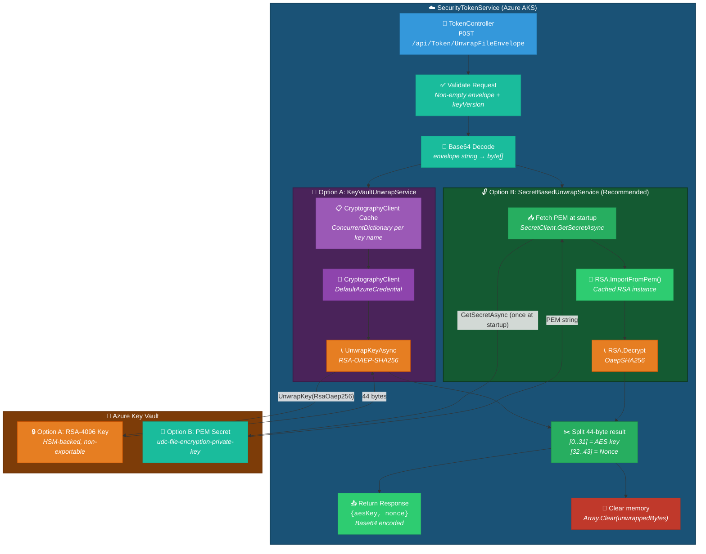
```mermaid
flowchart TB
    subgraph STS["☁️ SecurityTokenService (Azure AKS)"]
        direction TB
        
        CTRL["📡 TokenController<br/><code>POST /api/Token/UnwrapFileEnvelope</code>"]
        VALID["✅ Validate Request<br/><i>Non-empty envelope + keyVersion</i>"]
        DECODE["🔄 Base64 Decode<br/><i>envelope string → byte[]</i>"]
        
        subgraph OPTION_A["🔐 Option A: KeyVaultUnwrapService"]
            CACHE_A["📋 CryptographyClient Cache<br/><i>ConcurrentDictionary per key name</i>"]
            CLIENT_A["🔑 CryptographyClient<br/><i>DefaultAzureCredential</i>"]
            CALL_A["📞 UnwrapKeyAsync<br/><i>RSA-OAEP-SHA256</i>"]
            
            CACHE_A --> CLIENT_A
            CLIENT_A --> CALL_A
        end
        
        subgraph OPTION_B["🔓 Option B: SecretBasedUnwrapService (Recommended)"]
            FETCH["📥 Fetch PEM at startup<br/><i>SecretClient.GetSecretAsync</i>"]
            RSA_LOAD["🔑 RSA.ImportFromPem()<br/><i>Cached RSA instance</i>"]
            RSA_DEC["📞 RSA.Decrypt<br/><i>OaepSHA256</i>"]
            
            FETCH --> RSA_LOAD --> RSA_DEC
        end
        
        SPLIT["✂️ Split 44-byte result<br/><i>[0..31] = AES key<br/>[32..43] = Nonce</i>"]
        RESP["📤 Return Response<br/><code>{aesKey, nonce}</code><br/><i>Base64 encoded</i>"]
        CLEAR["🧹 Clear memory<br/><i>Array.Clear(unwrappedBytes)</i>"]
        
        CTRL --> VALID --> DECODE
        DECODE --> OPTION_A
        DECODE --> OPTION_B
        CALL_A --> SPLIT
        RSA_DEC --> SPLIT
        SPLIT --> RESP
        SPLIT --> CLEAR
    end

    subgraph KV["🔐 Azure Key Vault"]
        HSM["🔒 Option A: RSA-4096 Key<br/><i>HSM-backed, non-exportable</i>"]
        SECRET["📄 Option B: PEM Secret<br/><i>udc-file-encryption-private-key</i>"]
    end

    CALL_A -->|"UnwrapKey(RsaOaep256)"| HSM
    HSM -->|"44 bytes"| CALL_A
    FETCH -->|"GetSecretAsync (once at startup)"| SECRET
    SECRET -->|"PEM string"| FETCH

    style STS fill:#1a5276,stroke:#154360,stroke-width:2px,color:#fff
    style KV fill:#7d3c08,stroke:#6e3407,stroke-width:2px,color:#fff
    style CTRL fill:#3498db,stroke:#2980b9,color:#fff
    style VALID fill:#1abc9c,stroke:#16a085,color:#fff
    style DECODE fill:#1abc9c,stroke:#16a085,color:#fff
    style OPTION_A fill:#4a235a,stroke:#3b1c4a,stroke-width:2px,color:#fff
    style OPTION_B fill:#145a32,stroke:#0e3b22,stroke-width:2px,color:#fff
    style CACHE_A fill:#9b59b6,stroke:#8e44ad,color:#fff
    style CLIENT_A fill:#8e44ad,stroke:#7d3c98,color:#fff
    style CALL_A fill:#e67e22,stroke:#d35400,color:#fff
    style FETCH fill:#27ae60,stroke:#1e8449,color:#fff
    style RSA_LOAD fill:#2ecc71,stroke:#27ae60,color:#fff
    style RSA_DEC fill:#e67e22,stroke:#d35400,color:#fff
    style SPLIT fill:#27ae60,stroke:#1e8449,color:#fff
    style RESP fill:#2ecc71,stroke:#27ae60,color:#fff
    style CLEAR fill:#c0392b,stroke:#a93226,color:#fff
    style HSM fill:#e67e22,stroke:#d35400,color:#fff
    style SECRET fill:#1abc9c,stroke:#16a085,color:#fff
```

### API Contract

**Endpoint:** `POST /api/Token/UnwrapFileEnvelope`

**Request:**
```json
{
  "Envelope": "Base64-encoded 512-byte RSA envelope",
  "KeyVersion": "UDC_KEY_V_1.0"
}
```

**Response (200 OK):**
```json
{
  "AesKey": "Base64-encoded 32-byte AES-256 key",
  "Nonce": "Base64-encoded 12-byte GCM nonce"
}
```

**Error Responses:**

| Status | When |
|--------|------|
| 400 | Missing or empty `Envelope` / `KeyVersion` |
| 500 | Key Vault unreachable, key not found, or unwrap failure |

### Key Version → Key Name Mapping (Option A)

The STS maps logical key versions to Key Vault key names:

```csharp
// KeyVaultUnwrapService.cs (Option A — HSM-backed Key)
private static string GetKeyName(string keyVersion)
{
    // All current versions use the same key name.
    // When rotating to a new key, add mapping here.
    return "udc-file-encryption-key";
}
```

### Key Vault Client Caching (Option A)

```csharp
// One CryptographyClient per key name, cached in ConcurrentDictionary
private readonly ConcurrentDictionary<string, CryptographyClient> _clientCache = new();

private CryptographyClient GetOrCreateClient(string keyName)
{
    return _clientCache.GetOrAdd(keyName, name =>
    {
        var keyUri = new Uri($"{_keyVaultUrl}keys/{name}");
        return new CryptographyClient(keyUri, new DefaultAzureCredential());
    });
}
```

### Secret-Based Unwrap Service (Option B — Recommended)

In Option B, the private key PEM is stored as a Key Vault **Secret**. The STS fetches it once at startup, loads it into an RSA instance, and performs all unwrap operations locally — no per-file Key Vault API calls.

```csharp
// SecretBasedUnwrapService.cs (Option B — PEM from Key Vault Secret)
public class SecretBasedUnwrapService : IKeyVaultUnwrapService
{
    private readonly RSA _rsa;

    public SecretBasedUnwrapService(IConfiguration config)
    {
        // Fetch PEM from Key Vault Secret (once at startup)
        var vaultUrl = new Uri(config["KeyStoreUrl"]!);
        var secretName = config["UdcEncryption:PrivateKeySecretName"] 
            ?? "udc-file-encryption-private-key";
        
        var client = new SecretClient(vaultUrl, new DefaultAzureCredential());
        var secret = client.GetSecret(secretName);  // Synchronous — runs at startup
        
        _rsa = RSA.Create();
        _rsa.ImportFromPem(secret.Value.Value);
    }

    public Task<byte[]> UnwrapAsync(byte[] envelope)
    {
        // Local RSA decrypt — no network call per file
        byte[] keyMaterial = _rsa.Decrypt(envelope, RSAEncryptionPadding.OaepSHA256);
        return Task.FromResult(keyMaterial);
    }

    private static string GetSecretName(string keyVersion)
    {
        // Map key version to secret name for rotation support
        // V_1.0 and V_2.0 can point to different secrets
        return keyVersion switch
        {
            _ => "udc-file-encryption-private-key"  // Default secret name
        };
    }
}
```

### Option B — Key Vault Secret with Rotation Support

For key rotation, store multiple versioned secrets:

```bash
# Current key (V_1.0)
az keyvault secret set \
  --vault-name dp-meta-dev-eastus-kv \
  --name udc-file-encryption-private-key \
  --file udc-private-v1.pem \
  --content-type "application/x-pem-file"

# New key (V_2.0) — during rotation
az keyvault secret set \
  --vault-name dp-meta-dev-eastus-kv \
  --name udc-file-encryption-private-key-v2 \
  --file udc-private-v2.pem \
  --content-type "application/x-pem-file"
```

### DI Registration

```csharp
// StartupServices.cs — choose one based on KeyStoreType config

if (config["KeyStoreType"] == "AzureKeyVaultSecret")
{
    // Option B: PEM from Key Vault Secret (recommended)
    builder.Services.AddSingleton<IKeyVaultUnwrapService, SecretBasedUnwrapService>();
}
else
{
    // Option A: HSM-backed Key (default for backward compatibility)
    builder.Services.AddSingleton<IKeyVaultUnwrapService, KeyVaultUnwrapService>();
}
```

### Option Comparison at STS Level

| Aspect | Option A: `KeyVaultUnwrapService` | Option B: `SecretBasedUnwrapService` |
|--------|-----------------------------------|--------------------------------------|
| Key Vault calls per file | 1 (UnwrapKeyAsync) | 0 (key cached in memory) |
| Startup Key Vault calls | 0 | 1 (GetSecretAsync) |
| Latency per unwrap | ~20-50ms (network) | ~0.1ms (local RSA) |
| Offline after startup | ❌ Fails | ✅ Works |
| Private key in memory | ❌ Never | ⚠️ Yes (RSA instance) |
| Code complexity | Higher | Lower |

---

## 15. L4 Decryption Pipeline

### Components

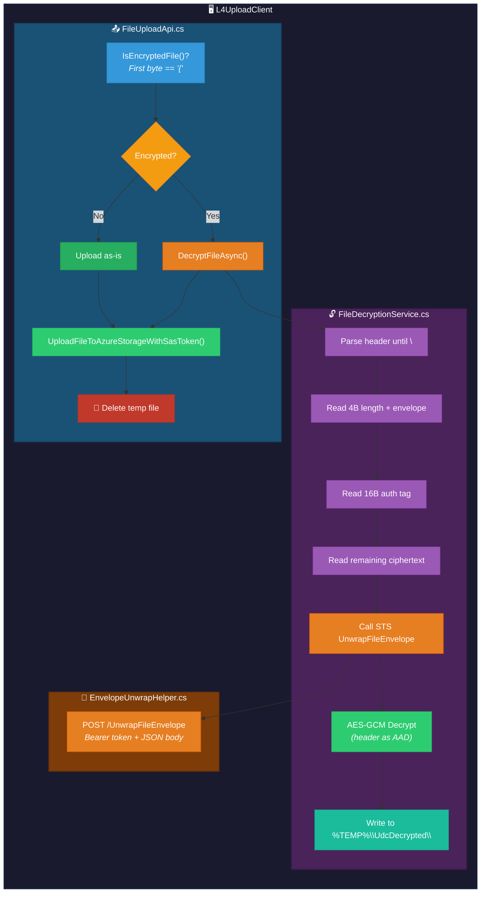
```mermaid
flowchart LR
    subgraph L4["🖥️ L4UploadClient"]
        direction TB
        
        subgraph UPLOAD["📤 FileUploadApi.cs"]
            CHECK["IsEncryptedFile()?<br/><i>First byte == '{'</i>"]
            DECIDE{Encrypted?}
            DECRYPT_PATH["DecryptFileAsync()"]
            NORMAL_PATH["Upload as-is"]
            UPLOAD_BLOB["UploadFileToAzureStorageWithSasToken()"]
            CLEANUP["🧹 Delete temp file"]
            
            CHECK --> DECIDE
            DECIDE -->|Yes| DECRYPT_PATH
            DECIDE -->|No| NORMAL_PATH
            DECRYPT_PATH --> UPLOAD_BLOB
            NORMAL_PATH --> UPLOAD_BLOB
            UPLOAD_BLOB --> CLEANUP
        end
        
        subgraph DECRYPT_SVC["🔓 FileDecryptionService.cs"]
            PARSE["Parse header until \\n"]
            READ_ENV["Read 4B length + envelope"]
            READ_TAG["Read 16B auth tag"]
            READ_CT["Read remaining ciphertext"]
            CALL_STS["Call STS UnwrapFileEnvelope"]
            AES_DEC["AES-GCM Decrypt<br/><i>(header as AAD)</i>"]
            WRITE_TEMP["Write to %TEMP%\\UdcDecrypted\\"]
            
            PARSE --> READ_ENV --> READ_TAG --> READ_CT --> CALL_STS --> AES_DEC --> WRITE_TEMP
        end
        
        subgraph HELPER["📡 EnvelopeUnwrapHelper.cs"]
            POST["POST /UnwrapFileEnvelope<br/><i>Bearer token + JSON body</i>"]
        end
        
        DECRYPT_PATH --> PARSE
        CALL_STS --> POST
    end

    style L4 fill:#1a1a2e,stroke:#16213e,stroke-width:2px,color:#fff
    style UPLOAD fill:#1a5276,stroke:#154360,stroke-width:2px,color:#fff
    style DECRYPT_SVC fill:#4a235a,stroke:#3b1c4a,stroke-width:2px,color:#fff
    style HELPER fill:#7d3c08,stroke:#6e3407,stroke-width:2px,color:#fff
    style CHECK fill:#3498db,stroke:#2980b9,color:#fff
    style DECIDE fill:#f39c12,stroke:#e67e22,color:#fff
    style DECRYPT_PATH fill:#e67e22,stroke:#d35400,color:#fff
    style NORMAL_PATH fill:#27ae60,stroke:#1e8449,color:#fff
    style UPLOAD_BLOB fill:#2ecc71,stroke:#27ae60,color:#fff
    style CLEANUP fill:#c0392b,stroke:#a93226,color:#fff
    style PARSE fill:#9b59b6,stroke:#8e44ad,color:#fff
    style READ_ENV fill:#9b59b6,stroke:#8e44ad,color:#fff
    style READ_TAG fill:#9b59b6,stroke:#8e44ad,color:#fff
    style READ_CT fill:#9b59b6,stroke:#8e44ad,color:#fff
    style CALL_STS fill:#e67e22,stroke:#d35400,color:#fff
    style AES_DEC fill:#2ecc71,stroke:#27ae60,color:#fff
    style WRITE_TEMP fill:#1abc9c,stroke:#16a085,color:#fff
    style POST fill:#e67e22,stroke:#d35400,color:#fff
```

### Encrypted File Detection

```csharp
// FileDecryptionService.cs
public bool IsEncryptedFile(string filePath)
{
    using var fs = File.OpenRead(filePath);
    var firstByte = fs.ReadByte();
    return firstByte == '{'; // Header JSON starts with '{'
}
```

Files without the encryption header (legacy unencrypted files) pass through unchanged — **full backward compatibility**.

### Decryption Flow (FileDecryptionService.DecryptFileAsync)

```csharp
// Step 1: Read header (everything before \n)
byte[] headerBytes = ReadUntilNewline(stream);
var header = JsonConvert.DeserializeObject<EncryptedFileHeader>(
    Encoding.UTF8.GetString(headerBytes));

// Step 2: Read envelope (4-byte length prefix + N bytes)
uint envelopeLength = ReadUInt32LittleEndian(stream);
byte[] envelope = ReadExactly(stream, (int)envelopeLength);

// Step 3: Read GCM auth tag (16 bytes)
byte[] tag = ReadExactly(stream, 16);

// Step 4: Read remaining ciphertext
byte[] ciphertext = ReadRemaining(stream);

// Step 5: Call STS to unwrap envelope → get AES key + nonce
var unwrapResponse = await _envelopeUnwrapHelper.UnwrapEnvelopeAsync(
    forgeToken, new EnvelopeUnwrapRequest
    {
        Envelope = Convert.ToBase64String(envelope),
        KeyVersion = header.KeyVersion
    });

// Step 6: AES-256-GCM decrypt with header as AAD
using var aesGcm = new AesGcm(aesKey, 16);
aesGcm.Decrypt(nonce, ciphertext, tag, plaintext, headerBytes);

// Step 7: Write to temp file, return path
string tempPath = Path.Combine(Path.GetTempPath(), "UdcDecrypted", fileName);
File.WriteAllBytes(tempPath, plaintext);
return tempPath;
```

### Upload Hook (FileUploadApi.cs)

```csharp
// Before blob upload
string fileToUpload = filePath;
string? decryptedPath = null;

if (_fileDecryptionService.IsEncryptedFile(filePath))
{
    try
    {
        decryptedPath = await _fileDecryptionService.DecryptFileAsync(filePath);
        fileToUpload = decryptedPath;
        _logger.LogInformation("Decrypted file for upload: {FileName}", fileName);
    }
    catch (Exception ex)
    {
        _logger.LogError(ex, "Decryption failed for {FileName}, uploading encrypted", fileName);
        // Falls back to uploading the encrypted file
    }
}

// Upload (decrypted or original)
await TransferManager.UploadAsync(new FileInfo(fileToUpload), cloudBlockBlob);

// Cleanup temp
if (decryptedPath != null && File.Exists(decryptedPath))
    File.Delete(decryptedPath);
```

### DI Registration (Startup.cs)

```csharp
// HttpClient for STS communication (same pattern as StorageAccessTokenHelper)
services.AddHttpClient<IEnvelopeUnwrapHelper, EnvelopeUnwrapHelper>(client =>
{
    client.BaseAddress = new Uri(Configuration?["AppSettings:AuthProvider:STSBaseUrl"] ?? string.Empty);
    client.Timeout = TimeSpan.FromSeconds(timeout);
})
    .AddPolicyHandler(PollyPolicies.GetRetryPolicy(retryInterval, retryCount))
    .ConfigurePrimaryHttpMessageHandler(() =>
    {
        // Same proxy configuration as other STS clients
    });

services.AddTransient<FileDecryptionService>();
```

---

## 16. End-to-End Data Flow

### Complete Encryption → Decryption Pipeline

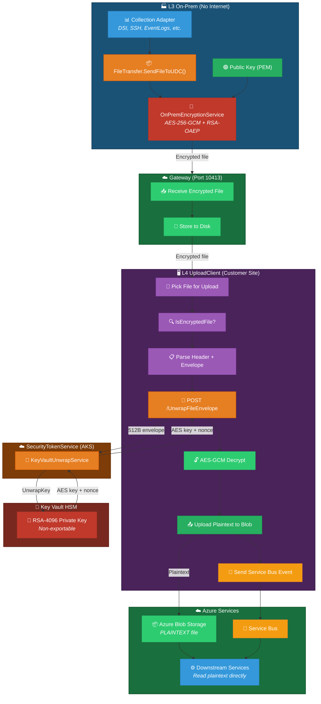
```mermaid
flowchart TB
    subgraph L3["🏭 L3 On-Prem (No Internet)"]
        ADAPTER["📊 Collection Adapter<br/><i>DSI, SSH, EventLogs, etc.</i>"]
        FT["📦 FileTransfer.SendFileToUDC()"]
        ENCRYPT["🔐 OnPremEncryptionService<br/><i>AES-256-GCM + RSA-OAEP</i>"]
        PUBKEY["🟢 Public Key (PEM)"]
        
        ADAPTER --> FT --> ENCRYPT
        PUBKEY --> ENCRYPT
    end
    
    subgraph GW["☁️ Gateway (Port 10413)"]
        RECV["📥 Receive Encrypted File"]
        STORE["💾 Store to Disk"]
        
        RECV --> STORE
    end
    
    subgraph L4["🖥️ L4 UploadClient (Customer Site)"]
        PICK["📂 Pick File for Upload"]
        DETECT["🔍 IsEncryptedFile?"]
        PARSE["📋 Parse Header + Envelope"]
        CALL_STS["📡 POST /UnwrapFileEnvelope"]
        AES_DEC["🔓 AES-GCM Decrypt"]
        UPLOAD["📤 Upload Plaintext to Blob"]
        SB_EVENT["📨 Send Service Bus Event"]
        
        PICK --> DETECT --> PARSE --> CALL_STS --> AES_DEC --> UPLOAD --> SB_EVENT
    end
    
    subgraph STS["☁️ SecurityTokenService (AKS)"]
        UNWRAP["🔐 KeyVaultUnwrapService"]
    end
    
    subgraph KV["🔐 Key Vault HSM"]
        PRIVKEY["🔴 RSA-4096 Private Key<br/><i>Non-exportable</i>"]
    end
    
    subgraph AZURE["☁️ Azure Services"]
        BLOB["📦 Azure Blob Storage<br/><i>PLAINTEXT file</i>"]
        SBUS["📨 Service Bus"]
        DOWN["⚙️ Downstream Services<br/><i>Read plaintext directly</i>"]
        
        BLOB --> DOWN
        SBUS --> DOWN
    end
    
    ENCRYPT -->|"Encrypted file"| GW
    STORE -->|"Encrypted file"| PICK
    CALL_STS -->|"512B envelope"| UNWRAP
    UNWRAP -->|"UnwrapKey"| PRIVKEY
    PRIVKEY -->|"AES key + nonce"| UNWRAP
    UNWRAP -->|"AES key + nonce"| CALL_STS
    UPLOAD -->|"Plaintext"| BLOB
    SB_EVENT --> SBUS

    style L3 fill:#1a5276,stroke:#154360,stroke-width:2px,color:#fff
    style GW fill:#196f3d,stroke:#145a32,stroke-width:2px,color:#fff
    style L4 fill:#4a235a,stroke:#3b1c4a,stroke-width:2px,color:#fff
    style STS fill:#7d3c08,stroke:#6e3407,stroke-width:2px,color:#fff
    style KV fill:#78281f,stroke:#641e16,stroke-width:2px,color:#fff
    style AZURE fill:#196f3d,stroke:#145a32,stroke-width:2px,color:#fff
    style ADAPTER fill:#3498db,stroke:#2980b9,color:#fff
    style FT fill:#e67e22,stroke:#d35400,color:#fff
    style ENCRYPT fill:#c0392b,stroke:#a93226,color:#fff
    style PUBKEY fill:#27ae60,stroke:#1e8449,color:#fff
    style RECV fill:#2ecc71,stroke:#27ae60,color:#fff
    style STORE fill:#2ecc71,stroke:#27ae60,color:#fff
    style PICK fill:#9b59b6,stroke:#8e44ad,color:#fff
    style DETECT fill:#9b59b6,stroke:#8e44ad,color:#fff
    style PARSE fill:#9b59b6,stroke:#8e44ad,color:#fff
    style CALL_STS fill:#e67e22,stroke:#d35400,color:#fff
    style AES_DEC fill:#2ecc71,stroke:#27ae60,color:#fff
    style UPLOAD fill:#27ae60,stroke:#1e8449,color:#fff
    style SB_EVENT fill:#f39c12,stroke:#e67e22,color:#fff
    style UNWRAP fill:#e67e22,stroke:#d35400,color:#fff
    style PRIVKEY fill:#c0392b,stroke:#a93226,color:#fff
    style BLOB fill:#2ecc71,stroke:#27ae60,color:#fff
    style SBUS fill:#f39c12,stroke:#e67e22,color:#fff
    style DOWN fill:#3498db,stroke:#2980b9,color:#fff
```

### Data State at Each Stage

| Stage | File State | Size | Who Can Read |
|-------|-----------|------|-------------|
| Adapter output | Plaintext (raw/zip/cab) | Original | Anyone with file access |
| After `SendFileToUDC()` | **Encrypted** (AES-256-GCM) | Original + 609 bytes | Only Key Vault holder |
| In transit (HTTPS) | **Encrypted** + TLS | Same | No one without both keys |
| On Gateway disk | **Encrypted** | Same | Only Key Vault holder |
| L4 picks up file | **Encrypted** | Same | Only Key Vault holder |
| After L4 decryption | **Plaintext** (temp file) | Original | L4 process only |
| Azure Blob | **Plaintext** (SSE at rest) | Original | SAS token holders |
| Downstream services | **Plaintext** | Original | Authorized services |

---

## 17. Implementation File Reference

### On-Prem Encryption (udc_management.service)

| File | Path | Purpose |
|------|------|---------|
| `OnPremEncryptionService.cs` | `src/FileTransfer/Encryption/` | AES-256-GCM encrypt + RSA-OAEP key wrapping with BouncyCastle |
| `EncryptedFileHeader.cs` | `src/FileTransfer/Models/` | Header model (v, s, ts, cat) with `[JsonProperty]` |
| `UdcEncryptionConfig.cs` | `src/FileTransfer/Models/` | Config model (SiteId, KeyVersion, PublicKeyPemPath) |
| `FileTransfer.cs` | `src/FileTransfer/` | Modified — encrypt hook at top of `SendFileToUDC()` |
| `FileTransfer.csproj` | `src/FileTransfer/` | Modified — added BouncyCastle + Newtonsoft.Json references |
| `packages.config` | `src/FileTransfer/` | Modified — added NuGet packages |

> **Framework:** .NET Framework 4.5.2 — uses BouncyCastle (AesGcm not available natively)

### Shared Models (escloud_Enabled-Services)

| File | Path | Purpose |
|------|------|---------|
| `EnvelopeUnwrapRequest.cs` | `src/Core/Core.Models/DataProtectionModels/` | Request DTO (Envelope, KeyVersion) |
| `EnvelopeUnwrapResponse.cs` | `src/Core/Core.Models/DataProtectionModels/` | Response DTO (AesKey, Nonce) |
| `EncryptedFileHeader.cs` | `src/Core/Core.Models/DataProtectionModels/` | Header model for cloud-side parsing |

### SecurityTokenService (escloud_Enabled-Services)

| File | Path | Purpose |
|------|------|---------|
| `IKeyVaultUnwrapService.cs` | `src/Gateways/Server/SecurityTokenService/Infrastructure/` | Interface for unwrap operations |
| `KeyVaultUnwrapService.cs` | `src/Gateways/Server/SecurityTokenService/Infrastructure/` | Key Vault CryptographyClient — calls UnwrapKeyAsync |
| `TokenController.cs` | `src/Gateways/Server/SecurityTokenService/Controllers/` | Modified — new `UnwrapFileEnvelope` endpoint |
| `StartupServices.cs` | `src/Gateways/Server/SecurityTokenService/` | Modified — DI registration for IKeyVaultUnwrapService |
| `SecurityTokenService.csproj` | `src/Gateways/Server/SecurityTokenService/` | Modified — Azure.Security.KeyVault.Keys + Azure.Identity |

> **Framework:** .NET 8 — runs in Azure AKS with managed identity

### L4UploadClient (escloud_Enabled-Services)

| File | Path | Purpose |
|------|------|---------|
| `IEnvelopeUnwrapHelper.cs` | `src/Gateways/Client/L4UploadClient/Infrastructure/` | Interface for STS unwrap calls |
| `EnvelopeUnwrapHelper.cs` | `src/Gateways/Client/L4UploadClient/Infrastructure/` | HTTP client — calls STS UnwrapFileEnvelope |
| `FileDecryptionService.cs` | `src/Gateways/Client/L4UploadClient/Infrastructure/` | Parses encrypted file, orchestrates unwrap + AES-GCM decrypt |
| `FileUploadApi.cs` | `src/Gateways/Client/L4UploadClient/Infrastructure/` | Modified — decrypt-before-upload hook |
| `Startup.cs` | `src/Gateways/Client/L4UploadClient/` | Modified — DI registration for unwrap helper + decryption service |

> **Framework:** .NET 8 — runs at customer site (L4) with internet access

### Gateway File Generation Encryption (udc_collection.gateway)

| File | Path | Purpose |
|------|------|--------|
| `IUdcEncryptionService.cs` | `src/Gateways/Gateway.Collection/Services/` | Interface — `Encrypt(byte[], category)`, `IsEnabled` |
| `UdcEncryptionService.cs` | `src/Gateways/Gateway.Collection/Services/` | .NET 8 native AES-256-GCM + RSA-OAEP (no BouncyCastle) |
| `UdcEncryptionSettings.cs` | `src/Gateways/Gateway.Collection/Models/` | Config model (Enabled, SiteId, KeyVersion, PublicKeyPemPath) |
| `ResultPacketFileWriteService.cs` | `src/Gateways/Gateway.Collection/BackgroundServices/` | Modified — encrypts time-series files when enabled |
| `ResultAssetDataService.cs` | `src/Gateways/Gateway.Collection/BackgroundServices/` | Modified — encrypts asset data files when enabled |
| `AgentStatusPacketFileWriteService.cs` | `src/Gateways/Gateway.Collection/BackgroundServices/` | Modified — encrypts agent status files when enabled |
| `Startup.cs` | `src/Gateways/Gateway.Collection/` | Modified — DI registration for `IUdcEncryptionService` |
| `appsettings.json` | `src/Gateways/Gateway.Collection/` | Modified — `UdcEncryption` config section |

> **Framework:** .NET 8 — uses native `System.Security.Cryptography.AesGcm` and `RSA.ImportFromPem()`. Same binary format as on-prem BouncyCastle implementation.

### POC / Prototype (poc-app)

| File | Path | Purpose |
|------|------|---------|
| `OnPremEncryptionService.cs` | `Services/` | .NET 8 native AesGcm reference implementation |
| `CloudDecryptionService.cs` | `Services/` | Roundtrip test (decrypt with private key locally) |
| `Program.cs` | `.` | Demo scenarios (encrypt, tamper detect, wrong-site reject) |

---

## 18. Configuration Reference

### On-Prem AppSettings (FileTransfer — .NET 4.5.2)

```xml
<!-- App.config or Web.config -->
<appSettings>
  <add key="UdcEncryptionEnabled" value="true" />
  <add key="UdcSiteId" value="SPA2K12" />
  <add key="UdcKeyVersion" value="UDC_KEY_V_1.0" />
  <add key="UdcPublicKeyPemPath" value="C:\ProgramData\Honeywell\UDC\Keys\udc-file-encryption-key.pem" />
</appSettings>
```

| Key | Required | Default | Description |
|-----|----------|---------|-------------|
| `UdcEncryptionEnabled` | Yes | `false` | Master on/off switch for encryption |
| `UdcSiteId` | Yes | — | Site identifier embedded in file header (AAD) |
| `UdcKeyVersion` | Yes | — | Key version string, maps to Key Vault key |
| `UdcPublicKeyPemPath` | Yes | — | Absolute path to RSA-4096 public key PEM file |

### Gateway AppSettings (Gateway.Collection — .NET 8)

```json
// appsettings.json — Gateway.Collection (port 10412)
{
  "UdcEncryption": {
    "Enabled": true,
    "SiteId": "SPA2K12",
    "KeyVersion": "UDC-KEY-120",
    "PublicKeyPemPath": "C:\\Keys\\UDC-KEY-120.pem"
  }
}
```

| Key | Required | Default | Description |
|-----|----------|---------|-------------|
| `UdcEncryption:Enabled` | Yes | `false` | Master on/off switch for gateway file encryption |
| `UdcEncryption:SiteId` | Yes | — | Site identifier embedded in file header (AAD) |
| `UdcEncryption:KeyVersion` | Yes | — | Key version string, maps to Key Vault key |
| `UdcEncryption:PublicKeyPemPath` | Yes | — | Absolute path to RSA-4096 public key PEM file |

> **Note:** The gateway encrypts files it **generates locally** (time-series, asset data, agent status). Files **received from agents** (already encrypted by on-prem `FileTransfer`) are stored as-is — the gateway does not re-encrypt them.

### SecurityTokenService Environment Variables

| Variable | Example | Description |
|----------|---------|-------------|
| `KeyStoreUrl` | `https://dp-meta-dev-eastus-kv.vault.azure.net/` | Key Vault URL |
| `MANAGED_IDENTITY` | `true` | Use managed identity for Key Vault auth |
| `KeyStoreType` | `AzureKeyVaultSecret` | Key store backend: `AzureKeyVault` (Option A — HSM Key) or `AzureKeyVaultSecret` (Option B — PEM Secret) |
| `UdcEncryption__PrivateKeySecretName` | `udc-file-encryption-private-key` | *(Option B only)* Key Vault secret name containing the private key PEM |

### L4UploadClient AppSettings (appsettings.json)

```json
{
  "AppSettings": {
    "AuthProvider": {
      "STSBaseUrl": "https://sts.example.com/"
    },
    "ProxySettings": {
      "IsRequired": "true",
      "Address": "proxy.customer.com",
      "Port": "8080"
    }
  }
}
```

> The `EnvelopeUnwrapHelper` uses the **same** `STSBaseUrl` and proxy settings as `StorageAccessTokenHelper` — no new configuration required at L4.

---

## 19. Security Analysis

### Threat Model

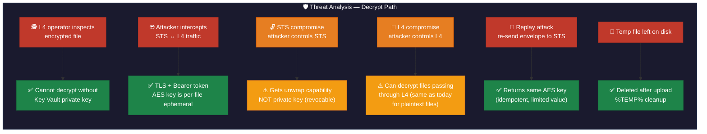
```mermaid
flowchart TB
    subgraph THREATS["🛡️ Threat Analysis — Decrypt Path"]
        direction TB
        
        T1["🕵️ L4 operator inspects<br/>encrypted file"]
        T2["🌐 Attacker intercepts<br/>STS ↔ L4 traffic"]
        T3["🔓 STS compromise<br/>attacker controls STS"]
        T4["🏴 L4 compromise<br/>attacker controls L4"]
        T5["📡 Replay attack<br/>re-send envelope to STS"]
        T6["🔑 Temp file left on disk"]
        
        M1["✅ Cannot decrypt without<br/>Key Vault private key"]
        M2["✅ TLS + Bearer token<br/>AES key is per-file ephemeral"]
        M3["⚠️ Gets unwrap capability<br/>NOT private key (revocable)"]
        M4["⚠️ Can decrypt files passing<br/>through L4 (same as today<br/>for plaintext files)"]
        M5["✅ Returns same AES key<br/>(idempotent, limited value)"]
        M6["✅ Deleted after upload<br/>%TEMP% cleanup"]
        
        T1 --> M1
        T2 --> M2
        T3 --> M3
        T4 --> M4
        T5 --> M5
        T6 --> M6
    end

    style THREATS fill:#1a1a2e,stroke:#16213e,stroke-width:2px,color:#fff
    style T1 fill:#c0392b,stroke:#a93226,color:#fff
    style T2 fill:#c0392b,stroke:#a93226,color:#fff
    style T3 fill:#e67e22,stroke:#d35400,color:#fff
    style T4 fill:#e67e22,stroke:#d35400,color:#fff
    style T5 fill:#c0392b,stroke:#a93226,color:#fff
    style T6 fill:#c0392b,stroke:#a93226,color:#fff
    style M1 fill:#1e8449,stroke:#196f3d,color:#fff
    style M2 fill:#1e8449,stroke:#196f3d,color:#fff
    style M3 fill:#f39c12,stroke:#e67e22,color:#fff
    style M4 fill:#f39c12,stroke:#e67e22,color:#fff
    style M5 fill:#1e8449,stroke:#196f3d,color:#fff
    style M6 fill:#1e8449,stroke:#196f3d,color:#fff
```

### Security Guarantees (Decrypt Path)

| Property | Guarantee | How |
|----------|-----------|-----|
| **Private key isolation** | Private key NEVER leaves Key Vault HSM | CryptographyClient.UnwrapKeyAsync — HSM-side operation |
| **Per-file key isolation** | Each file has a unique random AES key + nonce | Compromising one key doesn't affect other files |
| **Memory hygiene** | AES key cleared after use | `Array.Clear()` on STS side, GC on L4 side |
| **Auth required** | Both Forge JWT token AND valid RSA envelope needed | Attacker can't call endpoint without both |
| **Backward compatible** | Unencrypted files pass through unchanged | `IsEncryptedFile()` check — first byte `{` |
| **Graceful degradation** | If decryption fails, encrypted file is uploaded | try/catch in FileUploadApi — logs error, continues |
| **No new L4 config** | Uses existing STSBaseUrl + proxy settings | Same HttpClient pattern as SAS token requests |

### Comparison: AES Key Transit vs SAS Token Transit

| Aspect | AES Key (new) | SAS Token (existing) |
|--------|--------------|---------------------|
| Channel | HTTPS + Bearer | HTTPS + Bearer |
| Sensitivity | Decrypts one file | Full blob read/write access |
| Lifetime | Ephemeral (seconds) | Minutes to hours |
| Scope | Single file | Entire container |
| If intercepted | One file exposed | Container exposed |

> **Conclusion:** The AES key transit is **less sensitive** than the SAS tokens L4 already handles through the same channel.

---

## 20. Failure Modes & Resilience

| Failure | Impact | Recovery |
|---------|--------|----------|
| **Key Vault unavailable** | STS returns 500, L4 decryption fails | Upload encrypted file (graceful degradation) + Polly retry |
| **STS unavailable** | L4 HTTP timeout | Polly retry policy (configured retryCount/retryInterval) |
| **Invalid envelope** | Key Vault UnwrapKey fails | STS returns 500, L4 uploads encrypted + logs error |
| **Wrong key version** | Key Vault can't find key | STS returns 500, L4 uploads encrypted + logs error |
| **Corrupted ciphertext** | AES-GCM `AuthenticationTagMismatchException` | L4 uploads encrypted + logs error |
| **Disk full at L4** | Temp file write fails | L4 uploads encrypted + logs error |
| **Network timeout (L4 ↔ STS)** | HttpClient timeout | Polly retry, then upload encrypted |
| **Out of memory** | Large file decrypt OOM | L4 uploads encrypted + logs error |

### Graceful Degradation Pattern

```csharp
// FileUploadApi.cs — if anything fails, upload the encrypted file
if (_fileDecryptionService.IsEncryptedFile(filePath))
{
    try
    {
        decryptedPath = await _fileDecryptionService.DecryptFileAsync(filePath);
        fileToUpload = decryptedPath;  // ✅ Success: upload plaintext
    }
    catch (Exception ex)
    {
        _logger.LogError(ex, "Decryption failed for {FileName}, uploading encrypted", fileName);
        fileToUpload = filePath;       // ⚠️ Fallback: upload encrypted
    }
}
```

> **No data loss.** If decryption fails for any reason, the original encrypted file is uploaded. Downstream services won't be able to read it, but the data is preserved and can be decrypted later once the issue is resolved.

---

## Appendix: On-Prem File Paths Reference

All files are staged under `C:\ProgramData\Honeywell\UDCAgentData\` (configurable via `UDCAgentFileDataDirectory` AppSetting).

| Category | Typical Path |
|----------|-------------|
| **DSI_MDCT** | `C:\ProgramData\Honeywell\UDCAgentData\DSI\*.zip` |
| **DSI_ECC** | `C:\ProgramData\Honeywell\UDCAgentData\DSI\*.zip` |
| **DSI_SHOWTECH** | `C:\ProgramData\Honeywell\UDCAgentData\DSI\*.zip` |
| **INVENTORY_*** | `C:\ProgramData\Honeywell\UDCAgentData\INVENTORY\*.cab` |
| **ES_SSHLOG** | `C:\ProgramData\Honeywell\UDCAgentData\SSHLOG\*.txt` |
| **ES_EXPERIONEVENTLOGS** | `C:\ProgramData\Honeywell\UDCAgentData\ExperionEventLogs\*` |
| **ES_DATACOLLECTIONERRORS** | `C:\ProgramData\Honeywell\UDCAgentData\DataCollectionErrors\*` |
| **CI** | `C:\ProgramData\Honeywell\UDCAgentData\CI\*` |

### Key AppSettings

| Key | Default | Purpose |
|-----|---------|---------|
| `UDCAgentFileDataDirectory` | `Honeywell\UDCAgentData` | Base directory for all file categories |
| `DSIOutputDirectory` | `Honeywell\UDCAgentData\DSI` | DSI-specific output directory |
| `UDCFileCollectionGatewayURL` | — | Gateway base URL (port 10413) |
| `ChunkUploadAPI` | — | Chunk upload endpoint path |

> File paths arrive via `FilePacket.FilePath` set by each adapter. FileTransfer reads them at `ProcessPipeline()`, and all bytes pass through `SendFileToUDC()` where encryption is applied.

## Appendix: Encoding Pipeline Reference

| Category | Adapter-Level Encoding | FileTransfer Encoding | FileTransfer Compression | Chunked? |
|---|---|---|---|---|
| INVENTORY_* | CAB or raw TXT | None | None | No |
| ES_SSHLOG | Base64 (EncodeString) | None (skipped) | ZIP (ZipArchive) | No |
| ES_EXPERIONEVENTLOGS | None | Base64 (EncodeStream) | ZIP (ZipArchive) | No |
| ES_DATACOLLECTIONERRORS | None | None (skipped) | ZIP (ZipArchive) | No |
| DSI_MDCT, DSI_SHOWTECH | ZIP (ZipFile.CreateFromDirectory) | None | None | Yes |
| DSI_ECC | ZIP (pre-existing) | None | None | Yes |
| CI | None | None | None | Yes |

> With encryption enabled, the `OnPremEncryptionService.EncryptBytes()` call in `SendFileToUDC()` happens **after** all adapter-level and FileTransfer-level encoding/compression. The encryption wraps the final byte array regardless of upstream processing.

---

## 21. Gateway-Side File Generation Encryption

The UDC Collection Gateway (port 10412) **generates files locally** — time-series data, asset data, and agent status — before they are picked up by downstream systems. These files use **Base64 encoding** (`EncodeExtension.EncodeString()`) but had no encryption. With the `UdcEncryptionService`, the gateway now applies the **same envelope encryption** used by the on-prem FileTransfer module.

### What Gets Encrypted

| Background Service | File Prefix | Category Tag | Description |
|---|---|---|---|
| `ResultPacketFileWriteService` | `UDC_TS_` | `TIMESERIES` | Structured time-series ResultPacket data from agents |
| `ResultAssetDataService` *(obsolete)* | `UDC_AD_` | `ASSETDATA` | Asset data from UDC Management Service |
| `AgentStatusPacketFileWriteService` | `AGENTSTATUS_` | `AGENTSTATUS` | Deployed agent status snapshots |

### .NET 8 Native Crypto (No BouncyCastle)

The gateway is .NET 8, so we use the built-in `System.Security.Cryptography` APIs:

| Crypto Operation | .NET 8 API | On-Prem (.NET 4.5.2) Equivalent |
|---|---|---|
| AES-256-GCM encrypt | `new AesGcm(key, 16)` | `BouncyCastle GcmBlockCipher + AesFastEngine` |
| RSA-OAEP-SHA256 wrap | `RSA.Create() + ImportFromPem() + Encrypt()` | `BouncyCastle OaepEncoding + RsaEngine` |
| Random key gen | `RandomNumberGenerator.GetBytes(32)` | `BouncyCastle SecureRandom` |
| Key memory zeroing | `CryptographicOperations.ZeroMemory()` | `Array.Clear()` |

### Encryption Flow

```
JSON content → Base64 encode (existing) → AES-256-GCM encrypt (new) → binary file
```

When `UdcEncryption:Enabled = false` (default):
- Behavior is **unchanged** — Base64-encoded text files written via `StreamWriter`

When `UdcEncryption:Enabled = true`:
- Content is encrypted using `IUdcEncryptionService.Encrypt()`
- Output written as **binary** via `File.WriteAllBytesAsync()` (not `StreamWriter`)
- Same binary layout as on-prem: `Header JSON + \n | 4-byte envelope length | RSA envelope | 16-byte GCM tag | ciphertext`

### Backward Compatibility

- The `IsFileEncodingRequired` flag continues to control Base64 encoding **before** encryption
- Encrypted output contains the Base64-encoded content, so cloud-side decryption produces the same data the existing pipeline expects
- Agent status files always Base64-encode (no flag) — this is preserved

---

## 22. Cloud-Side Decryption for Malware Scanning

### The Problem

When files are encrypted with UDC envelope encryption (AES-256-GCM), **Microsoft Defender for Storage cannot scan them**. Defender sees random bytes and either:
- Returns `"No threats found"` (false negative — it literally cannot read the content)
- Or scans the ciphertext which has zero security value

The existing pipeline relies on Defender writing blob index tags after scanning. The MalwareScan service polls these tags to gate files before they reach downstream consumers. With encrypted files, this scan is meaningless.

### Why Not Decrypt at L4 Before Upload?

Section 13 covers the **L4 decryption path** where L4UploadClient decrypts before uploading plaintext to blob storage. That works for the L4 upload path. However, there may be upload paths where:
- Files land in dirty storage still encrypted (direct API uploads, gateway-generated files, IoT paths)
- L4 decryption is not available or fails (graceful degradation uploads encrypted file as fallback)

These encrypted blobs need a **cloud-side decryption hook** before Defender can provide a meaningful scan.

### Two Approaches

Two viable approaches exist for cloud-side decryption. Both use the same decryption logic (`IKeyVaultUnwrapService`, AES-256-GCM decrypt, envelope parsing) — they differ in **where** and **when** the decryption happens:

| | Approach A | Approach B |
|--|-----------|-----------|
| **Name** | MalwareScan Decrypts to Separate Path | AppFileDistribution Decrypts During Move |
| **Where** | `DefenderScanService` (MalwareScan) | `ApplicationFileDistributionMessageService` (AppFileDistribution) |
| **When** | Before Defender poll loop | During dirty→clean ADLS move |
| **Defender gates pipeline?** | Yes — real scan on plaintext before file reaches clean ADLS | No — Defender on clean ADLS scans post-arrival (not gating) |
| **Services modified** | 1 (MalwareScan) | 2 (MalwareScan + AppFileDistribution) |
| **Blob downloads through service** | 2× (MalwareScan downloads + AppFileDistribution copies server-side) | 1× (AppFileDistribution downloads, decrypts, uploads to clean) |
| **Intermediate storage** | Yes — `decrypted-{container}` in dirty storage | No — plaintext goes directly to clean ADLS |
| **Cleanup needed** | Yes — lifecycle policy for decrypted blobs | No |

### Existing Pipeline Context

Before diving into each approach, here's what the current pipeline does without encryption:

```
FileProcessor API → uploads blob to dirty storage
                  → publishes CommonFileUploadEvent to Service Bus (appmalwarefilescannertopic)
                      ↓
MalwareScan Service → polls Defender tags (GetTags) on dirty blob
                    → routes: Clean / Malicious / NotScanned / NotSupported
                    → publishes to appfiledistributionservicetopic
                        ↓
AppFileDistribution → Clean: server-side copy (TransferManager.CopyAsync, CopyMethod.ServiceSideAsyncCopy)
                             dirty → clean ADLS, then delete source
                    → Malicious: delete from dirty
                    → NotScanned/NotSupported: leave in dirty, let app decide
                    → generates SAS token, publishes downstream
```

**Key fact about AppFileDistribution's move:** It uses `CopyMethod.ServiceSideAsyncCopy` — the blob bytes travel within Azure's backbone between storage accounts. The service issues a REST call and waits. **Zero bytes flow through the application process.** This is important when comparing the two approaches.

### How the Service Bus Message Works (Both Approaches)

The `CommonFileUploadEvent` is published by **FileProcessor API** (not by any blob trigger) after it uploads the blob to dirty storage. It carries:

| Property | Value | Used By |
|----------|-------|---------|
| `BlobUrl` | URL of the encrypted blob in dirty storage | Both approaches — to locate the blob |
| `ContainerName` | Blob container name | AppFileDistribution — for dirty→clean move |
| `BlobName` | Blob name within container | AppFileDistribution — for dirty→clean move |
| `BlobSizeInBytes` | File size | MalwareScan — small vs large file routing |
| `SiteID` | Originating site | Downstream routing |
| `Application` | App name (ES, TWIN, DSI, etc.) | Downstream routing |
| `ScanResult` | Set by MalwareScan before publishing | AppFileDistribution — routing decision |

**No new Service Bus message is needed for either approach.** The existing event carries all required information. MalwareScan receives it, processes the file, and publishes the same event (with `ScanResult` set) to `appfiledistributionservicetopic`.

---

## 22a. Approach A — MalwareScan Decrypts to Separate Path

**One service change. No new infrastructure. No new Azure Functions. No new Service Bus topics. Defender scan gates the pipeline.**

The MalwareScan service — which already has the blob client and sits in the polling loop for minutes — adds a decryption step before polling. It downloads the encrypted blob, decrypts it, uploads the plaintext to a `decrypted-{container}/` path in the same dirty storage, and polls Defender tags on **that** fresh blob instead.

### End-to-End Sequence

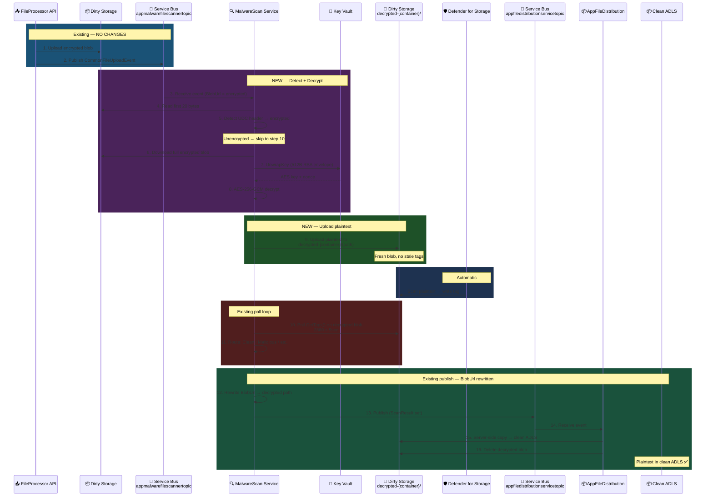
```mermaid
sequenceDiagram
    participant FP as 📤 FileProcessor API
    participant Dirty as 📦 Dirty Storage
    participant SB as 📨 Service Bus<br/>appmalwarefilescannertopic
    participant MS as 🔍 MalwareScan Service
    participant KV as 🔐 Key Vault
    participant DecPath as 📂 Dirty Storage<br/>decrypted-{container}/
    participant Def as 🛡️ Defender for Storage
    participant OutSB as 📨 Service Bus<br/>appfiledistributionservicetopic
    participant AFD as 📦 AppFileDistribution
    participant Clean as 📦 Clean ADLS

    rect rgb(26, 82, 118)
        Note over FP,SB: Existing — NO CHANGES
        FP->>Dirty: 1. Upload encrypted blob
        FP->>SB: 2. Publish CommonFileUploadEvent
    end

    rect rgb(74, 35, 90)
        Note over MS,KV: NEW — Detect + Decrypt
        SB->>MS: 3. Receive event (BlobUrl = encrypted)
        MS->>Dirty: 4. Read first 20 bytes
        MS->>MS: 5. Detect UDC header → encrypted
        Note over MS: Unencrypted → skip to step 10
        MS->>Dirty: 6. Download full encrypted blob
        MS->>KV: 7. UnwrapKey (512B RSA envelope)
        KV-->>MS: AES key + nonce
        MS->>MS: 8. AES-256-GCM decrypt
    end

    rect rgb(30, 81, 40)
        Note over MS,DecPath: NEW — Upload plaintext
        MS->>DecPath: 9. Upload plaintext to<br/>decrypted-{container}/{path}
        Note over DecPath: Fresh blob, no stale tags
    end

    rect rgb(30, 50, 80)
        Note over Def: Automatic
        Def->>DecPath: Scan plaintext → write tag
    end

    rect rgb(80, 30, 30)
        Note over MS: Existing poll loop
        MS->>DecPath: 10. Poll GetTags() on decrypted blob<br/>2880 × 5sec
        MS->>MS: 11. Route: Clean / Malicious / etc.
    end

    rect rgb(26, 82, 60)
        Note over MS,Clean: Existing publish — BlobUrl rewritten
        MS->>MS: 12. Rewrite BlobUrl → decrypted path
        MS->>OutSB: 13. Publish (ScanResult set)
        OutSB->>AFD: 14. Receive event
        AFD->>DecPath: 15. Server-side copy → clean ADLS
        AFD->>DecPath: 16. Delete decrypted blob
        Note over Clean: Plaintext in clean ADLS ✅
    end
```

### Storage Layout

```
Dirty Storage Account
├── {container}/                         ← Original encrypted blobs (from FileProcessor)
│   └── SPA2K12/dsi/file.zip            ← Encrypted (AES-256-GCM envelope)
│
└── decrypted-{container}/               ← Plaintext copies (MalwareScan creates)
    └── SPA2K12/dsi/file.zip            ← Plaintext (Defender scans THIS)
```

Path derivation is deterministic — prepend `decrypted-` to the container name:

```
Original:   https://dirtystorage.blob.core.windows.net/uploads/SPA2K12/dsi/file.zip
Decrypted:  https://dirtystorage.blob.core.windows.net/decrypted-uploads/SPA2K12/dsi/file.zip
```

### Data Movement Analysis

| Step | Operation | Data through service? | Time (288 MB) |
|------|-----------|----------------------|---------------|
| MalwareScan downloads encrypted blob | `BlobClient.DownloadContentAsync` | Yes — full blob | ~1-3 sec |
| MalwareScan decrypts in memory | AES-256-GCM | CPU only | ~0.6 sec |
| MalwareScan uploads plaintext | `BlobClient.UploadAsync` | Yes — full blob | ~1-3 sec |
| Defender scans | Azure internal | No | seconds |
| MalwareScan polls tags | `BlobClient.GetTags()` | Tiny REST calls | minutes-hours |
| AppFileDistribution moves to clean | `TransferManager.CopyAsync(ServiceSideAsyncCopy)` | **No — Azure backbone** | seconds |

**Total extra overhead: ~3-6 seconds** for a 288 MB file, on a pipeline where the poll loop alone runs minutes to hours. Negligible.

### Code Changes — MalwareScan Service

#### Modified: `DefenderScanService.cs`

```csharp
// DefenderScanService.cs — modified TriggerScan()

public async Task<ScanResult> TriggerScan(
    CommonFileUploadEvent fileUploadEvent,
    BlobClient blobClient,
    CancellationToken cancellationToken)
{
    // Existing: check exclusion list
    if (IsExcludedFileType(fileUploadEvent, cancellationToken))
    {
        return ScanResult.NotSupported;
    }

    // ── NEW: Detect and handle encrypted files ──────────────────────
    BlobClient targetBlobClient = blobClient;

    if (_udcDecryptionEnabled && await IsUdcEncryptedBlob(blobClient))
    {
        _logger.LogInformation(
            "Encrypted file detected for {BlobUrl}, decrypting to separate path",
            fileUploadEvent.BlobUrl);

        try
        {
            // Decrypt and upload plaintext to decrypted-{container}/ path
            var decryptedBlobClient = await DecryptToSeparatePath(
                blobClient, fileUploadEvent, cancellationToken);

            // Poll Defender tags on the DECRYPTED blob
            targetBlobClient = decryptedBlobClient;

            // Rewrite the event so downstream gets plaintext
            fileUploadEvent.BlobUrl = decryptedBlobClient.Uri.ToString();
            fileUploadEvent.ContainerName = $"decrypted-{fileUploadEvent.ContainerName}";
        }
        catch (Exception ex)
        {
            _logger.LogError(ex, "Decryption failed for {BlobUrl}, routing to manual process",
                fileUploadEvent.BlobUrl);
            return ScanResult.NotScanned; // → ManualProcessHandler
        }
    }
    // ────────────────────────────────────────────────────────────────

    // Existing: poll Defender tags (now targets decrypted blob if encrypted)
    return await ScanProcessEvent(fileUploadEvent, targetBlobClient, cancellationToken);
}
```

#### New: Encryption Detection

```csharp
private async Task<bool> IsUdcEncryptedBlob(BlobClient blobClient)
{
    try
    {
        // Read first 20 bytes — UDC header starts with {"v":"UDC_KEY_V_
        var range = new HttpRange(0, 20);
        var download = await blobClient.DownloadContentAsync(
            new BlobDownloadOptions { Range = range });
        var headerStart = Encoding.UTF8.GetString(download.Value.Content.ToArray());
        return headerStart.StartsWith("{\"v\":\"UDC_KEY_V_");
    }
    catch (Exception ex)
    {
        _logger.LogWarning(ex, "Could not check encryption header, treating as unencrypted");
        return false;
    }
}
```

#### New: Decrypt to Separate Path

```csharp
private async Task<BlobClient> DecryptToSeparatePath(
    BlobClient encryptedBlobClient,
    CommonFileUploadEvent fileUploadEvent,
    CancellationToken cancellationToken)
{
    // 1. Download the full encrypted blob
    var downloadResult = await encryptedBlobClient.DownloadContentAsync(cancellationToken);
    var encryptedBytes = downloadResult.Value.Content.ToArray();

    // 2. Decrypt (handles both single-segment and concatenated chunks)
    var plaintext = await DecryptUdcEnvelope(encryptedBytes);

    // 3. Compute decrypted blob path
    var uri = new Uri(fileUploadEvent.BlobUrl);
    var container = uri.Segments[1].TrimEnd('/');
    var blobPath = string.Join("", uri.Segments.Skip(2));
    var decryptedContainer = $"{_decryptedContainerPrefix}{container}";

    var serviceClient = new BlobServiceClient(_dirtyStorageConnectionString);
    var containerClient = serviceClient.GetBlobContainerClient(decryptedContainer);
    await containerClient.CreateIfNotExistsAsync(cancellationToken: cancellationToken);
    var decryptedBlobClient = containerClient.GetBlobClient(
        Uri.UnescapeDataString(blobPath));

    // 4. Upload plaintext (Defender auto-scans on blob creation)
    using var plaintextStream = new MemoryStream(plaintext);
    await decryptedBlobClient.UploadAsync(plaintextStream, overwrite: true,
        cancellationToken: cancellationToken);

    _logger.LogInformation("Decrypted blob uploaded to {Uri}", decryptedBlobClient.Uri);
    return decryptedBlobClient;
}
```

### What Changes, What Doesn't (Approach A)

| Component | Changes? | Details |
|-----------|----------|---------|
| **FileProcessor API** | ❌ No | Uploads encrypted blob + publishes event as before |
| **Service Bus topics** | ❌ No | Same topics, same subscriptions |
| **MalwareScan Service** | ✅ Yes | `DefenderScanService` — detect encryption, decrypt to separate path, poll decrypted blob |
| **MalwareScan StartupServices** | ✅ Yes | Register `IKeyVaultUnwrapService` |
| **MalwareScan .csproj** | ✅ Yes | Add `Azure.Security.KeyVault.Keys` + `Azure.Identity` |
| **MalwareScan appsettings** | ✅ Yes | Add `KeyStoreUrl`, `UdcDecryption` section |
| **AppFileDistribution** | ❌ No | Receives `BlobUrl` pointing to plaintext in `decrypted-{container}` — server-side copy to clean ADLS works as before |
| **Downstream services** | ❌ No | Consume plaintext blobs from clean ADLS |
| **Dirty Storage** | ✅ Yes | New `decrypted-{container}` containers auto-created |

### Cleanup Policy (Approach A)

Decrypted blobs in `decrypted-{container}` are intermediate artifacts. Two cleanup mechanisms:

**1. AppFileDistribution already deletes:** For clean files, `MoveBlobAcrossStorageAccountsAsync` calls `sourceBlob.DeleteIfExistsAsync()` after the server-side copy — the decrypted blob is deleted. For malicious files, `DeleteBlobAsync` deletes it.

**2. Lifecycle policy as safety net:** Auto-delete blobs in `decrypted-*` containers after N days to catch any orphans:

```json
{
  "rules": [{
    "name": "cleanup-decrypted-dirty",
    "type": "Lifecycle",
    "definition": {
      "filters": { "prefixMatch": ["decrypted-"] },
      "actions": {
        "baseBlob": { "delete": { "daysAfterCreationGreaterThan": 7 } }
      }
    }
  }]
}
```

**Also need to clean up the original encrypted blob.** AppFileDistribution currently deletes the source blob after copy — but the source is now `decrypted-{container}`, not the original `{container}`. The original encrypted blob is orphaned. Options:
- MalwareScan deletes the original after creating the decrypted copy
- Lifecycle policy on the original containers catches them
- AppFileDistribution deletes both (requires knowing the original path)

### Configuration (Approach A)

```json
// appsettings.json — MalwareScan Service additions
{
  "KeyStoreUrl": "https://dp-meta-dev-eastus-kv.vault.azure.net/",
  "UdcDecryption": {
    "Enabled": true,
    "DecryptedContainerPrefix": "decrypted-",
    "KeyName": "udc-file-encryption-key"
  }
}
```

---

## 22b. Approach B — AppFileDistribution Decrypts During Move

**More efficient data movement. No intermediate storage. Replaces the server-side copy with download+decrypt+upload for encrypted files. Defender scan is post-arrival, not gating.**

Instead of MalwareScan downloading the blob, AppFileDistribution — which already owns the dirty→clean move — downloads the encrypted blob, decrypts it, and uploads plaintext **directly to clean ADLS**. No intermediate `decrypted-{container}` needed. One download, one upload, one operation.

### Why This Approach?

AppFileDistribution currently does a **server-side copy** (`TransferManager.CopyAsync` with `ServiceSideAsyncCopy`) to move from dirty → clean ADLS. For encrypted files, this server-side copy would just move encrypted bytes to clean ADLS, which is useless. The move must be replaced with download → decrypt → upload for encrypted files.

Since AppFileDistribution **already needs to touch the blob** during the move, adding decryption here is natural — it's the same operation with a decrypt step in the middle. No extra downloads.

### End-to-End Sequence

```mermaid
sequenceDiagram
    participant FP as 📤 FileProcessor API
    participant Dirty as 📦 Dirty Storage
    participant SB1 as 📨 Service Bus<br/>appmalwarefilescannertopic
    participant MS as 🔍 MalwareScan Service
    participant SB2 as 📨 Service Bus<br/>appfiledistributionservicetopic
    participant AFD as 📦 AppFileDistribution
    participant KV as 🔐 Key Vault
    participant Clean as 📦 Clean ADLS
    participant Def as 🛡️ Defender on Clean ADLS

    rect rgb(26, 82, 118)
        Note over FP,SB1: Existing — NO CHANGES
        FP->>Dirty: 1. Upload encrypted blob
        FP->>SB1: 2. Publish CommonFileUploadEvent
    end

    rect rgb(74, 35, 90)
        Note over MS: MalwareScan — MINIMAL CHANGE
        SB1->>MS: 3. Receive event
        MS->>Dirty: 4. Read first 20 bytes
        MS->>MS: 5. Detect UDC header → encrypted
        Note over MS: Encrypted file from trusted source<br/>Defender cannot scan ciphertext<br/>→ bypass meaningless poll
        MS->>MS: 6. Set ScanResult = Clean
        MS->>MS: 7. Set IsEncrypted = true (new flag)
        MS->>SB2: 8. Publish to appfiledistributionservicetopic
    end

    rect rgb(125, 60, 8)
        Note over AFD,Clean: AppFileDistribution — decrypt during move
        SB2->>AFD: 9. Receive event (ScanResult=Clean, IsEncrypted=true)
        AFD->>Dirty: 10. Download encrypted blob
        AFD->>AFD: 11. Detect UDC header, parse envelope
        AFD->>KV: 12. UnwrapKey (512B RSA envelope)
        KV-->>AFD: AES key + nonce
        AFD->>AFD: 13. AES-256-GCM decrypt
        AFD->>Clean: 14. Upload PLAINTEXT to clean ADLS
        AFD->>Dirty: 15. Delete encrypted blob from dirty
    end

    rect rgb(30, 50, 80)
        Note over Def,Clean: Defender on Clean ADLS (post-arrival)
        Def->>Clean: 16. Scan plaintext → write tag
        Note over Def: Post-arrival scan — does NOT gate pipeline<br/>but provides defense-in-depth monitoring
    end

    rect rgb(26, 82, 60)
        Note over AFD: Continue existing flow
        AFD->>AFD: 17. Generate SAS token for clean blob
        AFD->>AFD: 18. Publish downstream<br/>(multiappfiledistributiontopic)
        Note over AFD: Downstream gets plaintext ✅
    end
```

### Data Movement Analysis

| Step | Operation | Data through service? | Time (288 MB) |
|------|-----------|----------------------|---------------|
| AppFileDistribution downloads encrypted blob | `BlobClient.DownloadContentAsync` | Yes — full blob | ~1-3 sec |
| AppFileDistribution decrypts in memory | AES-256-GCM | CPU only | ~0.6 sec |
| AppFileDistribution uploads plaintext to clean | `BlobClient.UploadAsync` | Yes — full blob | ~1-3 sec |
| AppFileDistribution deletes dirty blob | `DeleteIfExistsAsync` | Tiny REST call | <0.1 sec |

**Compared to current (no encryption):** The current server-side copy is ~seconds with zero bytes through the service. Approach B adds ~3-6 seconds of service-side data transfer. Still fast, but the service now processes the full blob in memory.

**Compared to Approach A:** Approach A has the same ~3-6 sec in MalwareScan, then AppFileDistribution does a server-side copy from `decrypted-{container}` to clean ADLS. Total is the same wall time, but Approach A keeps AppFileDistribution's server-side copy intact (zero bytes through AppFileDistribution).

### Code Changes — MalwareScan Service (Minimal)

#### Modified: `DefenderScanService.cs`

MalwareScan detects encryption and **bypasses** the Defender poll loop — encrypted ciphertext cannot be meaningfully scanned.

```csharp
// DefenderScanService.cs — modified TriggerScan()

public async Task<ScanResult> TriggerScan(
    CommonFileUploadEvent fileUploadEvent,
    BlobClient blobClient,
    CancellationToken cancellationToken)
{
    // Existing: check exclusion list
    if (IsExcludedFileType(fileUploadEvent, cancellationToken))
    {
        return ScanResult.NotSupported;
    }

    // ── NEW: Skip Defender poll for encrypted files ─────────────────
    if (_udcDecryptionEnabled && await IsUdcEncryptedBlob(blobClient))
    {
        _logger.LogInformation(
            "Encrypted file detected for {BlobUrl}, bypassing Defender scan",
            fileUploadEvent.BlobUrl);

        // Mark as encrypted so AppFileDistribution knows to decrypt
        fileUploadEvent.MetaData ??= new Dictionary<string, string>();
        fileUploadEvent.MetaData["UdcEncrypted"] = "true";

        // Treat as clean — file is from trusted on-prem source
        // Real scan happens on clean ADLS after AppFileDistribution decrypts
        return ScanResult.Clean;
    }
    // ────────────────────────────────────────────────────────────────

    // Existing: poll Defender tags for unencrypted files
    return await ScanProcessEvent(fileUploadEvent, blobClient, cancellationToken);
}
```

> **Note:** `IsUdcEncryptedBlob()` is the same 20-byte header check used in Approach A (see Shared Components below).

### Code Changes — AppFileDistribution Service

#### Modified: `ApplicationFileDistributionMessageService.cs`

The clean file path replaces the server-side copy with download+decrypt+upload when the file is encrypted.

```csharp
// ApplicationFileDistributionMessageService.cs — modified ProcessMalwareScannedFilesAsync()

// Inside the ScanResult.Clean branch:
else if (commonFileUploadEvent.ScanResult == ScanResult.Clean)
{
    commonFileUploadEvent.BlobName = Uri.UnescapeDataString(commonFileUploadEvent.BlobName);

    bool isEncrypted = commonFileUploadEvent.MetaData != null
        && commonFileUploadEvent.MetaData.TryGetValue("UdcEncrypted", out var enc)
        && enc == "true";

    if (isEncrypted && _udcDecryptionEnabled)
    {
        // Download encrypted → decrypt → upload plaintext to clean ADLS
        await _storageServices.DecryptAndMoveToCleanAsync(
            dirtyStorageConnectionString,
            commonFileUploadEvent.ContainerName,
            commonFileUploadEvent.BlobName,
            cleanStorageConnectionString,
            commonFileUploadEvent.ContainerName,
            commonFileUploadEvent.BlobName,
            _keyVaultUnwrapService);

        _logger.LogInformation(
            "Decrypted and moved encrypted file {BlobName} to clean ADLS for SiteId {SiteId}",
            commonFileUploadEvent.BlobName, commonFileUploadEvent.SiteID);
    }
    else
    {
        // Existing: server-side copy (unencrypted files)
        await _storageServices.MoveBlobAcrossStorageAccountsAsync(
            dirtyStorageConnectionString,
            commonFileUploadEvent.ContainerName,
            commonFileUploadEvent.BlobName,
            cleanStorageConnectionString,
            commonFileUploadEvent.ContainerName,
            commonFileUploadEvent.BlobName);
    }

    _logger.LogInformation(
        "Successfully moved Clean file {BlobName} to Clean ADLS for SiteId {SiteId}",
        commonFileUploadEvent.BlobName, commonFileUploadEvent.SiteID);
}
```

#### New: `StorageServices.DecryptAndMoveToCleanAsync`

```csharp
// StorageServices.cs — new method

public async Task DecryptAndMoveToCleanAsync(
    string sourceConnString, string sourceContainer, string sourceBlobName,
    string targetConnString, string targetContainer, string targetBlobName,
    IKeyVaultUnwrapService keyVaultUnwrapService)
{
    try
    {
        _logger.LogInformation(
            "Decrypting and moving encrypted blob {BlobName} to clean ADLS", sourceBlobName);

        // 1. Download encrypted blob from dirty storage
        var sourceServiceClient = new BlobServiceClient(sourceConnString);
        var sourceContainerClient = sourceServiceClient.GetBlobContainerClient(sourceContainer);
        var sourceBlobClient = sourceContainerClient.GetBlobClient(sourceBlobName);

        var downloadResult = await sourceBlobClient.DownloadContentAsync();
        var encryptedBytes = downloadResult.Value.Content.ToArray();

        // 2. Decrypt (uses shared UdcDecryptionHelper)
        var plaintext = await UdcDecryptionHelper.DecryptAsync(
            encryptedBytes, keyVaultUnwrapService);

        // 3. Upload plaintext to clean ADLS
        var targetServiceClient = new BlobServiceClient(targetConnString);
        var targetContainerClient = targetServiceClient.GetBlobContainerClient(targetContainer);
        await targetContainerClient.CreateIfNotExistsAsync();
        var targetBlobClient = targetContainerClient.GetBlobClient(targetBlobName);

        using var plaintextStream = new MemoryStream(plaintext);
        await targetBlobClient.UploadAsync(plaintextStream, overwrite: true);

        // 4. Delete encrypted source blob
        await sourceBlobClient.DeleteIfExistsAsync();

        _logger.LogInformation(
            "Successfully decrypted and moved blob {BlobName} to clean ADLS", sourceBlobName);
    }
    catch (Exception ex)
    {
        _logger.LogError(ex,
            "Error decrypting and moving blob {BlobName} to clean ADLS", sourceBlobName);
        throw;
    }
}
```

### What Changes, What Doesn't (Approach B)

| Component | Changes? | Details |
|-----------|----------|---------|
| **FileProcessor API** | ❌ No | Uploads encrypted blob + publishes event as before |
| **Service Bus topics** | ❌ No | Same topics, same subscriptions |
| **MalwareScan Service** | ✅ Yes | `DefenderScanService` — detect encryption, bypass Defender poll, mark `UdcEncrypted` in metadata |
| **MalwareScan .csproj** | ❌ No | No new packages — only reads 20 bytes for header detection |
| **AppFileDistribution** | ✅ Yes | `ProcessMalwareScannedFilesAsync` — decrypt during move for encrypted files |
| **AppFileDistribution StorageServices** | ✅ Yes | New `DecryptAndMoveToCleanAsync` method |
| **AppFileDistribution StartupServices** | ✅ Yes | Register `IKeyVaultUnwrapService` |
| **AppFileDistribution .csproj** | ✅ Yes | Add `Azure.Security.KeyVault.Keys` + `Azure.Identity` |
| **AppFileDistribution appsettings** | ✅ Yes | Add `KeyStoreUrl`, `UdcDecryption` section |
| **Downstream services** | ❌ No | Consume plaintext blobs from clean ADLS |
| **Dirty Storage** | ❌ No | No new containers — encrypted blobs are deleted after decrypt+move |

### Defender Scan — Post-Arrival vs Gating

In Approach B, Defender on clean ADLS scans the plaintext **after** it arrives. This scan does not gate the pipeline — downstream services may start consuming the file before the scan completes.

**Is this acceptable?**

Consider what happens today without encryption: Defender scans blobs in **dirty** storage, and MalwareScan polls the result to gate the file. With Approach B, this gating is bypassed for encrypted files.

However:
- Encrypted files come from **controlled on-prem systems** (adapters, Gateway), not from arbitrary user uploads
- Defender scanning encrypted bytes is already meaningless — the current `"No threats found"` result on ciphertext has zero security value
- Defender on clean ADLS still provides **defense-in-depth** — if a malicious file somehow gets through, the tag is written and can be monitored via alerts
- A background job could periodically check Defender tags on recently-arrived clean ADLS blobs and quarantine any flagged files

### Configuration (Approach B)

```json
// appsettings.json — AppFileDistribution Service additions
{
  "KeyStoreUrl": "https://dp-meta-dev-eastus-kv.vault.azure.net/",
  "UdcDecryption": {
    "Enabled": true,
    "KeyName": "udc-file-encryption-key"
  }
}
```

```json
// appsettings.json — MalwareScan Service additions
{
  "UdcDecryption": {
    "Enabled": true
  }
}
```

> MalwareScan only needs a feature flag (no Key Vault access) — it just detects and bypasses. AppFileDistribution needs Key Vault access for the actual decryption.

---

## 22c. Shared Components (Both Approaches)

Both approaches use the same encryption detection, envelope parsing, and Key Vault unwrap logic. These can live in a shared library or be duplicated in the service that needs them.

### `IKeyVaultUnwrapService` — RSA Envelope Unwrap

```csharp
// Infrastructure/IKeyVaultUnwrapService.cs
public interface IKeyVaultUnwrapService
{
    Task<byte[]> UnwrapAsync(byte[] envelope, string keyVersion);
}
```

```csharp
// Infrastructure/KeyVaultUnwrapService.cs
public class KeyVaultUnwrapService : IKeyVaultUnwrapService
{
    private readonly string _keyVaultUrl;
    private readonly ConcurrentDictionary<string, CryptographyClient> _clientCache = new();

    public KeyVaultUnwrapService(IConfiguration config)
    {
        _keyVaultUrl = config["KeyStoreUrl"];
    }

    public async Task<byte[]> UnwrapAsync(byte[] envelope, string keyVersion)
    {
        var keyName = GetKeyName(keyVersion);
        var client = GetOrCreateClient(keyName);
        var result = await client.UnwrapKeyAsync(KeyWrapAlgorithm.RsaOaep256, envelope);
        return result.Key;
    }

    private CryptographyClient GetOrCreateClient(string keyName)
    {
        return _clientCache.GetOrAdd(keyName, name =>
        {
            var keyUri = new Uri($"{_keyVaultUrl}keys/{name}");
            return new CryptographyClient(keyUri, new DefaultAzureCredential());
        });
    }

    private static string GetKeyName(string keyVersion) => "udc-file-encryption-key";
}
```

> **Alternative (Option B from Section 14):** If the private key PEM is stored as a Key Vault Secret, use `SecretBasedUnwrapService` — zero per-file Key Vault API calls after startup. ~0.1ms per unwrap instead of ~20-50ms.

### `UdcDecryptionHelper` — Shared Decryption Logic

```csharp
// Infrastructure/UdcDecryptionHelper.cs
public static class UdcDecryptionHelper
{
    private const string HEADER_MARKER = "{\"v\":\"UDC_KEY_V_";

    /// <summary>
    /// Detects if byte array starts with a UDC encrypted file header.
    /// </summary>
    public static bool IsEncrypted(byte[] data)
    {
        if (data == null || data.Length < 20) return false;
        var header = Encoding.UTF8.GetString(data, 0, Math.Min(20, data.Length));
        return header.StartsWith(HEADER_MARKER);
    }

    /// <summary>
    /// Decrypts a UDC envelope-encrypted blob. Handles both single-segment
    /// files and concatenated chunks (merged by Gateway).
    /// </summary>
    public static async Task<byte[]> DecryptAsync(
        byte[] encryptedBytes,
        IKeyVaultUnwrapService unwrapService)
    {
        using var input = new MemoryStream(encryptedBytes);
        using var output = new MemoryStream();

        while (input.Position < input.Length)
        {
            // Parse one segment
            var headerBytes = ReadUntilNewline(input);     // Header JSON + \n
            var header = JsonSerializer.Deserialize<EncryptedFileHeader>(headerBytes);

            var envelopeLength = ReadUInt32LE(input);       // 4 bytes
            var envelope = ReadExactly(input, (int)envelopeLength);  // RSA envelope
            var tag = ReadExactly(input, 16);                // GCM auth tag

            // Remaining ciphertext up to next header or EOF
            var ciphertext = ReadUntilNextHeaderOrEnd(input);

            // Unwrap RSA envelope → AES key + nonce
            var keyMaterial = await unwrapService.UnwrapAsync(envelope, header.KeyVersion);
            var aesKey = keyMaterial[..32];
            var nonce = keyMaterial[32..44];

            // AES-256-GCM decrypt with header as AAD
            var plaintext = new byte[ciphertext.Length];
            using var aesGcm = new AesGcm(aesKey, 16);
            aesGcm.Decrypt(nonce, ciphertext, tag, plaintext, headerBytes);

            output.Write(plaintext);

            // Zero sensitive key material
            CryptographicOperations.ZeroMemory(aesKey);
            CryptographicOperations.ZeroMemory(nonce);
            CryptographicOperations.ZeroMemory(keyMaterial);
        }

        return output.ToArray();
    }

    // Stream parsing helpers (ReadUntilNewline, ReadUInt32LE, ReadExactly, etc.)
    // ...
}
```

### NuGet Package References

The service performing decryption needs:

```xml
<!-- Required for Key Vault CryptographyClient -->
<PackageReference Include="Azure.Security.KeyVault.Keys" Version="4.*" />
<PackageReference Include="Azure.Identity" Version="1.*" />
```

> `Azure.Storage.Blobs` is already referenced in both services. `System.Security.Cryptography.AesGcm` is built into .NET 8.

### Handling Chunked Files

For chunked uploads (DSI_MDCT, DSI_ECC, etc.), the Gateway merges encrypted chunks into a single blob. Each chunk was encrypted independently by `SendFileToUDC()` with its own AES key and RSA envelope.

The merged blob contains **concatenated encrypted segments**:

```
[Header₁ + \n + Envelope₁ + Tag₁ + Ciphertext₁][Header₂ + \n + Envelope₂ + Tag₂ + Ciphertext₂]...
```

`UdcDecryptionHelper.DecryptAsync()` handles this via the `while (input.Position < input.Length)` loop — it processes each segment, unwraps its unique RSA envelope, decrypts with its unique AES key, and concatenates the plaintext.

**Performance:** Each chunk requires one Key Vault `UnwrapKey` call (~20-50ms). A file with 6 chunks = ~300ms of Key Vault overhead. Negligible in both approaches.

### DI Registration

```csharp
// StartupServices.cs — whichever service performs decryption
services.AddSingleton<IKeyVaultUnwrapService, KeyVaultUnwrapService>();
```

---

## 22d. Approach Comparison

### Head-to-Head

| Aspect | Approach A (MalwareScan Decrypts) | Approach B (AppFileDistribution Decrypts) |
|--------|-----------------------------------|-------------------------------------------|
| **Defender gates pipeline** | ✅ Yes — real scan on decrypted blob before clean ADLS | ❌ No — scan is post-arrival on clean ADLS |
| **Services modified** | 1 (MalwareScan) | 2 (MalwareScan + AppFileDistribution) |
| **Blob data through services** | MalwareScan: 1 download + 1 upload<br/>AppFileDistribution: server-side copy (0 bytes) | MalwareScan: 0 bytes<br/>AppFileDistribution: 1 download + 1 upload |
| **Intermediate storage** | `decrypted-{container}` in dirty storage | None — straight to clean ADLS |
| **Cleanup needed** | Lifecycle policy for `decrypted-*` containers + original encrypted blobs | No — encrypted blob deleted after decrypt+move |
| **Key Vault access needed by** | MalwareScan service | AppFileDistribution service |
| **New packages in** | MalwareScan (Azure.Security.KeyVault.Keys, Azure.Identity) | AppFileDistribution (Azure.Security.KeyVault.Keys, Azure.Identity) |
| **Time to first poll** | After decrypt+upload (~3-6 sec) | N/A — no poll for encrypted files |
| **Total wall time** | Same as unencrypted + ~3-6 sec | Faster — skips entire poll loop for encrypted files |
| **AppFileDistribution's server-side copy** | Preserved (copies from `decrypted-` to clean) | Replaced with download+decrypt+upload for encrypted files |
| **Unencrypted file path** | Unchanged — existing flow | Unchanged — existing server-side copy |
| **Malicious file detection** | ✅ Before reaching clean ADLS | ⚠️ Only post-arrival on clean ADLS |

### Data Flow Comparison

```mermaid
flowchart TB
    subgraph A["Approach A — MalwareScan Decrypts"]
        direction LR
        A1["📦 Dirty<br/>(encrypted)"]
        A2["🔍 MalwareScan<br/>download + decrypt"]
        A3["📂 Dirty<br/>decrypted-container"]
        A4["🛡️ Defender<br/>scans plaintext"]
        A5["📦 AppFileDist<br/>server-side copy"]
        A6["📦 Clean ADLS<br/>(plaintext)"]

        A1 -->|"288 MB download"| A2
        A2 -->|"288 MB upload"| A3
        A3 -.->|"auto-scan"| A4
        A4 -.->|"poll tags"| A2
        A3 -->|"server-side copy<br/>0 bytes through app"| A5
        A5 --> A6
    end

    subgraph B["Approach B — AppFileDistribution Decrypts"]
        direction LR
        B1["📦 Dirty<br/>(encrypted)"]
        B2["🔍 MalwareScan<br/>detect + bypass"]
        B3["📦 AppFileDist<br/>download + decrypt"]
        B4["📦 Clean ADLS<br/>(plaintext)"]
        B5["🛡️ Defender<br/>post-arrival scan"]

        B1 -.->|"20 bytes"| B2
        B2 -.->|"bypass scan"| B3
        B1 -->|"288 MB download"| B3
        B3 -->|"288 MB upload"| B4
        B4 -.->|"auto-scan"| B5
    end

    style A fill:#1a1a2e,stroke:#16213e,stroke-width:2px,color:#fff
    style B fill:#1a1a2e,stroke:#16213e,stroke-width:2px,color:#fff
    style A1 fill:#c0392b,stroke:#a93226,color:#fff
    style A2 fill:#e67e22,stroke:#d35400,color:#fff
    style A3 fill:#f39c12,stroke:#e67e22,color:#fff
    style A4 fill:#2ecc71,stroke:#27ae60,color:#fff
    style A5 fill:#3498db,stroke:#2980b9,color:#fff
    style A6 fill:#1e8449,stroke:#196f3d,color:#fff
    style B1 fill:#c0392b,stroke:#a93226,color:#fff
    style B2 fill:#9b59b6,stroke:#8e44ad,color:#fff
    style B3 fill:#e67e22,stroke:#d35400,color:#fff
    style B4 fill:#1e8449,stroke:#196f3d,color:#fff
    style B5 fill:#2ecc71,stroke:#27ae60,color:#fff
```

### When to Choose Which

**Choose Approach A if:**
- Defender malware scan must **gate** the pipeline (compliance/security requirement)
- You want malicious files caught **before** they reach clean ADLS
- You prefer changing only one service
- The ~3-6 second decrypt overhead + `decrypted-{container}` cleanup is acceptable

**Choose Approach B if:**
- Files come from **trusted on-prem sources** (controlled adapters, not arbitrary user uploads)
- Defender scanning encrypted bytes is already meaningless — honesty over theater
- You want the most efficient data movement (one download, one upload, no intermediate storage)
- Post-arrival Defender scan on clean ADLS is sufficient for defense-in-depth
- Faster end-to-end processing (skips the entire MalwareScan poll loop for encrypted files)

### Failure Modes (Both Approaches)

| Failure | Impact | Recovery |
|---------|--------|----------|
| **Key Vault UnwrapKey fails** | Cannot decrypt | **A:** Route to ManualProcessHandler as `NotScanned` **B:** Leave encrypted in dirty, log error, retry |
| **Corrupted RSA envelope** | Unwrap fails | Same as above |
| **GCM auth tag mismatch** | Tampered or corrupted file | Log as security event, route to ManualProcessHandler |
| **Out of memory (large file)** | Decrypt OOM for files > available RAM | Use stream-based decrypt for files > threshold (e.g., 2 GB) |
| **Unencrypted file** | Header check returns false | Existing flow — no changes |
| **Partial/corrupt header** | Parse fails | Treat as unencrypted — existing flow |
| **Key version not found** | CryptographyClient can't find key | Route to ManualProcessHandler — may be a rotation window issue |

### Architecture Decision Record

| Decision | Rationale |
|----------|-----------|
| **No Azure Function / blob trigger** | Both approaches keep logic in existing services. No new infrastructure to deploy, monitor, or debug |
| **No new Service Bus topics** | Existing `CommonFileUploadEvent` carries all needed info. `MetaData` dictionary used for `UdcEncrypted` flag |
| **Shared `IKeyVaultUnwrapService`** | Same pattern as STS UnwrapFileEnvelope (Section 14). Can use HSM-backed or PEM-from-Secret backend |
| **Shared `UdcDecryptionHelper`** | Static helper handles both single-segment and chunked files. Reusable across services |
| **`IsUdcEncryptedBlob` reads only 20 bytes** | Minimal overhead — range download, no full blob fetch for detection |
| **Graceful fallback** | If decryption fails → ManualProcessHandler (Approach A) or leave in dirty + retry (Approach B). No data loss |
| **Backward compatible** | Unencrypted files follow exact existing path in both approaches — zero behavioral change |
